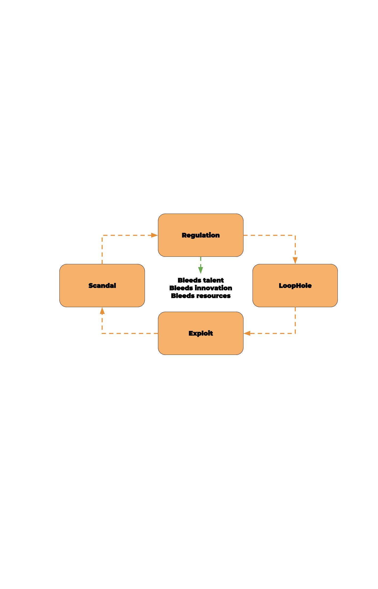
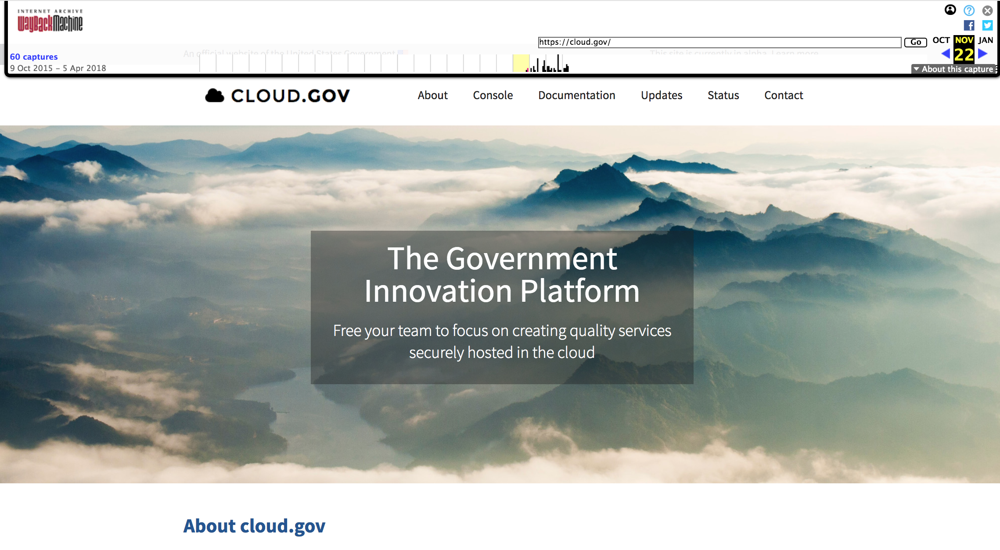
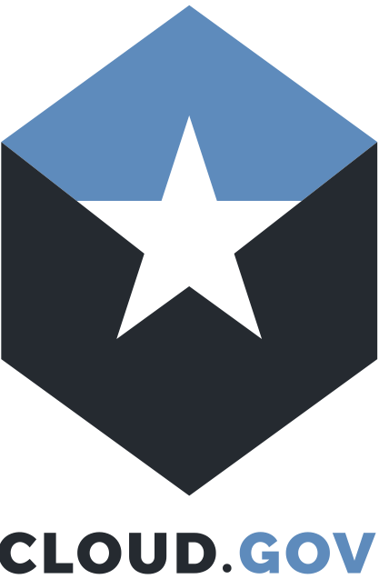

footer: @clouddotgov
slidenumbers: true
build-lists: true

# `#hi`

^Hi. I'm Peter Burkholder, with cloud.gov, I spend most of my days working to help federal agencies adopt cloud.gov, and more generally, the notion of working in a PaaS or other high-level computing abstraction.

^So it's exciting to be with folks who understand Cloud Foundry, and about working with technology in government, and the joys and challenges of that work.

^To understand the mission of cloud.gov, and it's raison d'etre, I think it's worth reflecting on why tech in government is challenging.

---

# Trust

^It might be tempting to assume, when you're using a government website and finding the experience less than delightful, that there's some truth to the narrative that the government inherently can't do technology well.

^But what constitutes doing "technology well" in any environment, public or private? 

^We know from research on team productivity and DevOps practices that the best outcomes are built on teams with a high-level of psychological trust, and when teams are empowered to deliver value. In other words, that trust is the key ingredient.

^But trust within government can become a rare commodity: our constitutional system is predicated on the populace not trusting the government, on the three branches set up to provide checks on the others' powers. Contracting and procurement are set up to not trust the person making the procurement (for fear of favoritism or nepotism), let alone the bidders on a contract. 

^Trust is replaced by regulation and audit. And this feeds what Brad Katsuyama dubbed 

---

# Regulated Industry Death Spiral

---

^A loophole or oversight exists, it's exploited, resulting in scandal. The response is to write more regulation. This bleeds talent, bleeds innovation, bleeds resources. So we're now more likely to miss a loophole, and the spiral continues.

^The regulatory spiral Specific to our domain is the ATO process. Any US Government information system, like a web application, must be granted an Authority to Operate, or ATO. Pertinent to CIO signing off on the ATO, and going to production, there are 4006 pages of regulations 4006! As a result, just the ATO process can take 6-14 months. 

^We can't regulate our way out of this.

---

> You can’t fix the problem of a system that is based on rigid rules by specifying new rules.
-- Jen Pahlka 

^We can inject innovation

---

^To inject innovation, the last administration established the Presidential Innovation Fellow program in 2012, which led in 2014 to the creation of 18F: a digital consultancy within the federal government, housed in the General Services Administration. The team assembled there tackled problems by starting from user-centered design, agile development, lean acquisition and open-source practices. 

^But thanks to those 4006 pages of regulation standing between their work and obtaining an ATO, their work was either stranded, or stuck. They simply couldn't ship.

---

[.footer: https://www.flickr.com/photos/martijnmunneke/3417016257]
---

### 6 to 14 months to ATO

^The shortcut to an ATO is to reuse technology that already satisfies most of those 4k pages. And cloud computing is a huge boon here. 

----

# The FedRAMP Marketplace (2015)

* Cloud Service Providers
* Compliance Control Inheritance:
    * IaaS: TKTK of 325
* Where's my PaaS?

^To foster use of cloud, the federal government has the FedRAMP program. Cloud service providers can complete the authorization process, specifying which security "controls" they satisfy, and then tenant agencies can build on top of that and largely inherit those controls. 

^In 2015 though, that FedRAMP Marketplace didn't include a general-purpose PaaS. If you started with IaaS provider, you could inherit controls for, say, the Physical Environment, Media Protection, Personnel Security. But if you're launching a system with a FISMA moderate impact, you need to document 325 controls. An IaaS would provide 85 of those, but you were still responsible for 240 controls regarding the operating systems, intrusion detection, logging, patching, etc. etc.  All things that a PaaS should provide.  

^There was no general purpose FedRAMP PaaS. So the 18F answer was to build their own PaaS, satisfy as many of those controls as possible, and make that available for other agencies throughout government. 

---

^The cloud.gov platform was launched for federal users in Autumn 2015. And if you we're present at the 2015 or 2016 CF summits, you may have caught Diego or Bret talking about cloud.gov. It's been awhile, and a lot is new.

^So let's do quick tour of what cloud.gov offers.  We, of course, offer the core functionality of Cloud Foundry: the ability to run application code for you in the cloud, along with self-service managed marketplace offerings. From a government perspective, our killer feature is security and compliance.

<!-- https://18f.gsa.gov/2015/10/09/cloud-gov-launch/ -->
<!-- https://schd.ws/hosted_files/cfsummit2016/13/CFSummit2016-cloud.gov-compliance.pdf -->

---

# Compliance and Security

1. FedRAMP JAB P-ATO
2. Control Inheritance
3. Security by Convention
4. Continuous Improvement

^First, we're FedRAMP JAB authorized for workloads up to FISMA moderate. If you're the CIO of the Agency of Silly Walks, and want to use cloud.gov, you and CISO can obtain from FedRAMP our entire System Security Plan, compliance finding, and outstanding items. You don't have to do you own technical audit, that's been done. You have the docs you need to determine whether our security posture fits your needs, and how you want to inherit those controls.  We've leveraged FedRAMP ourselves by building the platform atop AWS GovCloud, and inheriting their controls in our own SSP.

^Second, because we're platform-as-a-service, instead of infrastructure-as-a-service, a tenant can inherit a far larger number of security and compliance controls. For example, if you're running a FISMA-moderate workload, your security plan for an ATO needs to address 325 of NIST 800-53 controls. If you're building atop a typical IaaS, you could inherit and reuse TKTK controls.  When you run atop cloud.gov, you can inherit and reuse up to TKTK of those controls, document how we share responsibility for TKTK, and then you're fully responsible for the remaining TKTK.

^Third, we enable tenant security by making the secure choice the default choice. By reducing cognitive burden at the platform level, product teams can focus on security in their source code. Examples: S3 buckets are either public or private, and that's that, reducing the chance stashing private data in a bucket that is later accidentally exposed. S3 buckets enforce server-side encryption. DBs are encrypted at rest, and only allow TLS connections. And so on.

^Lastly, we're because we're a built-for-compliance offering, we're always looking for ways to make compliance easier on tenants. We notify our users when their buildpacks are out-of-date.  We're the only FedRAMP CSP to have an active bug bounty program. As Bret will tell you later, we're extending our container security with SysDig Falco.
<!-- I've only check AWS, Azure and CSP on this. -->

^Since all this work is open source, it means this is

---

# News you can use

^So you have these core security and compliance features, and we've enhanced or extended Cloud Foundry offering for our base, so I'll highlight a few of those in case you want to use them in your work

---

| Customer facing: | |
| --- | --- |
| cloud.gov Dashboard | Kibana proxy for tenant logs |
| CDN Broker for CloudFront + LetsEncrypt | Identity Broker to reuse UAA for applications |
| Notify tenants on outdated buildpacks | Create free Sandbox accounts |
| RDS & S3 Brokers | Redis & Elasticsearch Brokers for K8S |

---

| Infrastructure/Bosh |   |
| --- | --- |
| BOSH: Ship audit logs to CloudWatch | BOSH: PowerDNS for DNSSEC support |
| BOSH: ClamAV, Nessus, NewRelic | BOSH: Tripwire, Snort, Ubuntu hardening|
| Sandbox-bot: 90 day sweep-up|  NGINX `secureproxy`  |
| Terraform plans | Concourse pipelines |
| Ephemeral _Jumpboxes_ | BugBounty: Not a service |

^for CF Router to force HTTPS, add HTTP headers, set timeout & size limits |

---

| Plugins: |  |  |
|--- | --- | --- |
|service-connect | migrate-db | route-lookup |

^So, what's come of all this work?

--- 

# Making a difference

^The folks at 18F originally adopted Cloud Foundry to solve their delivery problem, they made into _cloud.gov_ to change how agencies operate. How has that worked out?

---

Agencies: |   |  
---|---|---
NOAA | Air Force | GSA
FDIC | FEC | Forest Service
Interior | Education | IRS
FBI | EPA | OMB
NSF |  USDS | ATF

---

## Federal Election Commission

^The case study on our site focusses on cost savings, and in a small agency dropping their reducing their $1.4M/annum spend by 85% made a real difference. But I've been more interested in the process and culture change where they could adopt Agile from inception to delivery. Instead of quarterly releases with high change fail rate, they now deliver weekly, and are engaged in user-centered design and rapid prototyping in their endeavor to move the filing system to cloud.gov, not just public view.

---

## Federal Deposit Insurance Corporation

^FDIC migrated their main public website to us, and the only time we paused doing continuous delivery of the platform was on Friday afternoon the first few months, because that was when they published bank seizures and they just wanted nothing to go wrong until they got confidence in our reliability.

^They are now eager cloud foundry users, and written their own "Compliance Bot" which they're not yet ready to open source, but it's a separate task worker periodically grab audit data, ship to S3, rotate service keys, do backups, and validate user roles. 

---

## Federalist 

^Many offices just need a static website they can update as needed. CMS's
are overkill for them, so our sibling project Federalist lets people edit locally, push to GitHub, preview on the web, and the publish.

^Federalist now hosts 119 sites for eight federal agencies.

---

# (Image: 1 month to ATO)

^Within GSA, many of our products are now built for cloud.gov, and we have team adept at generating the require documentation, and at working with our auditors. As the auditors are also now familiar with cloud.gov, this ATO Sprinting Team can obtain ATOs in less than a month.

^All this has us looking forward to 

---

The road ahead|   
---|---|
Multiple Clouds: |  Windows
CI/CD-as-a-Service | Container Runtime 
Isolation segments / TIC | FedRAMP High
**Adoption, adoption** | **Adoption, adoption** 

^Mostly, though, we're wanting to build adoption. We want agencies to deliver on their mission with speed and stability, in way that doesn't involve vendor lock-in, or dependency on a single cloud provider. The barriers there are less technical than they are cognitive and cultural.

---

# Clearing the five barriers to adoption

^Let's look at these five barriers, that I've seen, as you'll likely encounter the same when working with colleagues, internal organizations, or clients.

---

## 1. The ☁️ is someone else's 💻

^Although that saying is cute, and true, it points to a persistent mental model of thinking about "computers" instead of "compute".

^People can visualize their servers humming in racks in their datacenter, and perhaps they still have names. When you think of the cloud as someone else's computer, you'll picture virtual servers humming in virtual racks. It can be tempting to make a one-to-one mapping, and miss all the cloud opportunities for automation, elasticity, and disposability.

^A typical example: A potential customer shared with us the quote from an IaaS contractor. The quote spelled out, for each fo their environments, the number of CPUs and GBs RAM, for every server including the Varnish caching server, the NginX web server, the Redis server, and the DB Cluster itself. There was no mention of manage DB services, or scaling groups, or managed load balancers, let alone the cloud value add of a CICD pipelines and disposable infrastructure.

^Moving to naive IaaS, or lift-and-shift, fits that model, but brings few if any benefits.

^The best I can do at this point is to talk the mission-enablement provided by the code that's bundled in, say, a J2EE WAR file. That code, running in production, is what provides value. 

^Then consider all the bit in an IaaS needed to run that WAR file: VPC, jumpbox, server, OS, Java install, J2EE runtime, scaling group, load balancers, SSL certs, etc. Not to mention what the deployment process is going to be. None of that provides value as such. Only what runs in the WAR. With cloud.gov, you provide the WAR, and the platform takes care of the rest.

^But clearing that mental model wall brings us crashing into:

---

## 2. The broken mirror

^The person you're talking to, when they look in the mirror, sees someone who has years if not decades of experience running datacenters, spec'ing out hardware, configuring firewalls and routers, and learning the ins & outs of various operating systems. What we propose can be really threatening to their identity. We're not taking away their worries, we're potentially taking away their sense of self.

^This is real, and even if, or particularly if, there's an mandate coming from on high. And it won't be expressed openly, the speaker may just see their objections fully rooted in the org's best interests.

^What I'm finding is that it works to shift the conversation to all the things the PaaS or Automation doesn't do. The PaaS won't run every application. The applications that aren't cloud-ready need their expertise to get them to cloud ready. The PaaS is still dumb: it doesn't know how to scale your application. It doesn't know what to do with the logs it ships you. That's still on you. And the PaaS doesn't do all the things you've been wanting to do but never had time for: real CI/CD, meaningful dashboards, sensible alerting so you can sleep through the night, or finally getting the developers the tools they need.

^The broken mirror has one particular manifestation that needs to be called out as its own barrier. Namely, that "we already have a PaaS"

---

## 3. ✅PaaS 

^We already have a PaaS. In some cases, they see something like Cloud Foundry as either not having all the features they need, or being too complex for the smaller subset of features needed.

^If they've already investing in automation, then the "let's build our own PaaS" fever takes hold: I know, let's kick of the process with a Remedy ticket, which opens up a Puppet/Chef/Terraform template they can fill in, the it gets routed to Pat for approval, and that'll get checked out in a validation environment for security scans ... and so and so on. 

^Toolchains are awesome, but it's hard to enable flow in toolchain in an organization that hasn't practiced flow and continuous delivery. Time and again, in the public and private sector, I've seen this devolve into Platform-as-a-Concierge-Service, with bottlenecks acruing where manual work has to occur. But because it works for some folks, or because it was build "here", it can persist.

^For us, since cloud.gov is outside an organization's ecosystem, we can point to it as being low-risk experiment or pilot. It doesn't threaten the PaaCS if one pilot system moves to it. And if we can shift the conversation from outputs, "Hey we build this complex bespoke pseudo-PaaS", to outcomes: "lead time, # releases, MTTR"; then we can start to show the value of the PaaS approach.

---

## 4. Too risky  🎲🎰🎲🎰

^"Interesting, but we can't take the risk."  Because there are so many Federal regulations, once you've mastered a subset of them, and how they apply to your current operations, it's very easy for folks to get caught sticking with what they know, even if they know it's pretty awful.

^People may ask, "Is cloud.gov secure enough?" But that's the wrong question. The salient question is, "Where will my security posture be best — in cloud.gov, or in my onsite data center, or in an IaaS service using a new and unfamiliar toolset?"

^In general, the solution that minimize your attack surface is best, and enables a robust security architecture. But faulty risk perception can come in with the "Status Quo Bias", a cognitive bias that explains our preference for familiarity. We tend to resist change and prefer the current state of affairs. That tendency is buttressed by the endowment effect, the tendency of people, when making decisions, to give a higher weighting to things they already have.

^Personally, I'm experimenting more with talking about cognitive biases, usually with the angle that the people I'm talking to are wise enough to step back and weigh matters objectively. It's hard because I tend to want to make technical counterarguments, instead of saying: Yes, we can't account for all these hypotheticals. But is that better or worse than your current posture?

^The last barrier is: We don't need a PaaS, we have a DevOps team.
---

## 5. 🚫 PaaS  (we have a DevOps team)

^Everybody wants the DevOps. They read about the high performing organizations that move with speed _and_ stability. Then they focus on the tooling and the forms of DevOps, and lose sight of the outcomes which should be paramount. 

^Core to DevOps practice is having teams empowered to deliver value, to deliver on mission, without external bottlenecks. In private industry, in smaller start-ups, in mature DevOps organizations, it may be feasible to embed ops expertise in each team, and grant those teams the authority to make changes on behalf on the organizational goals.

^But as we discussed at the beginning of this talk, government and regulated industries are low-trust organizations. When I worked for Chef Software, I would see organizations that would have multiple Chef runs: One for ops, one for security, and one for the developers. Nevermind that they were practicing Infrastructure-as-Code -- that the same developer team they trusted to write code handling credit card data, they wouldn't trust to write code to install Tomcat on their systems. 

^So when folks insist they have a DevOps team, that might be awesome. But it often means they've created CI/CD and infra-as-code team that is, despite best intentions, just a bottleneck to value delivery, because now all changes have to go through that team, instead of trusting the people closest to the product.

---

# The PaaS to DevOps Outcomes

^In short, I believe that a high-level PaaS is a prerequisite for DevOps outcomes for application delivery in government. Without it, teams are unlikely to have the authority to create, change and delete resources, and there will be too many impediments to move with speed and stability. And that's what motivates us in cloud.gov:

---

[.background-color: #FFFFFF]
[.hide-footer]
[.slidecount: false]

^Technology in government is hard thanks to low trust, the regulatory death spiral, and that you can't rule-make your way out. Innovation is possible, but you need to automate compliance so you can focus on innovation. Cloud.gov paves the way to compliance and innovation, and is built with open source tools that you can leverage and learn from. The barriers now in the adoption of cloud.gov, or any highly-abstracted compute platform, are not technical so much as cultural -- so I hope that some of what we've observed will help you overcome similar obstacles in your path forward.

---

# Thank you!

(Image of our team from Zoom)

---

# References and Resources

Mark Schwartz, How DevOps Can Fix Federal Government IT, https://www.youtube.com/watch?v=QwHVlJtqhaI, DevOps Enterprise Summit 2014

Jen Pahlka, "Death Star Thinking and Government Refrom", Journal of Design and Science, https://jods.mitpress.mit.edu/pub/issue3-pahlka

Brad Katsuyama, Regulatory Death Spiral. _N.B._ I've been unable to find this other than one photo of slide online. Thanks to Julian Dunn for bringing it to my attention, e.g., https://www.slideshare.net/chef-software/security-at-velocity-dc-cap-one

cloud.gov repositories: https://cloud.gov/docs/ops/repos/

Characteristics of a PaaS: https://csrc.nist.gov/publications/detail/sp/800-145/final

Status Quo Bias: Mark Schwartz, March 2018: https://medium.com/aws-enterprise-collection/reducing-risk-in-the-cloud-by-overcoming-the-status-quo-bias-4a2459cca2ef and Daniel Kahneman, _Thinking, Fast and Slow_, 2013.

[.autoscale: true]

---

Points I haven't made yet:
* DOD and JEDI and PaaS first
* Legitimacy (A. Clay Shafer)
* What about _The Outage_?  DevOps investment, failure happens, drill for it.
* ATO sprinting team successes
* How does Kibana work?
* Is cloudfront going away?

<!-- 
# Globally
* United Kingdom GDS
* Australia 

N.B: Not doing this slide. Too hard to get right, doesn't add enough value.
-->
<!-- Kubectl is not the top of the architectural layer cake -->
<!-- A consistent PaaS definitely enables higher levels of DevOps achievement, but I've seen results even with basic, repurposeable dev/prod IT services.
https://twitter.com/aidanfeldman/status/968140481145303043 -->