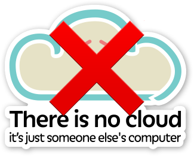
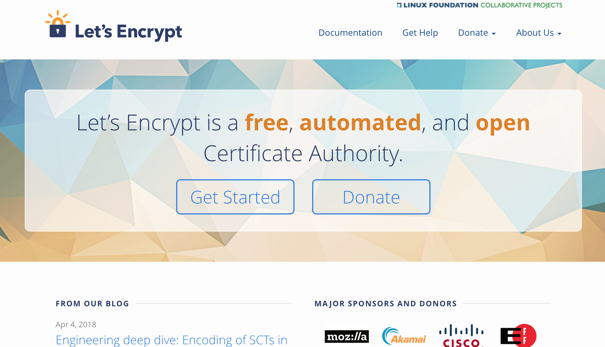

theme: work,7
footer: 
build-lists: true
slidenumbers: true

# `#hi`

^Hi. I'm Peter Burkholder, with cloud.gov, I spend most of my days working to help federal agencies adopt cloud.gov, and explaining what it means to work in Platform-as-a-Service.

^So it's exciting to be with folks who already understand Cloud Foundry, and may already  be using it government or in their own highly-regulated setting. 

^To understand cloud.gov and its mission, let's talk about the key ingredient to working effectively in technology: Trust

---

# Trust

* Psychological Safety
* Team Empowerment
* Regulatory Setting

^We know from research on team productivity and DevOps practices that the best outcomes are built on teams with a high-level of psychological trust, and when teams are empowered, are entrusted, to deliver value from concept to production.

^Now these are two different kinds of trust. 1! One is internal to a team: trust that your voice is heard, trust that you can fail without blame or shame. The other 2! is team context: Are they trusted to operate in their domain of expertise? Do they trust that failure will be treated as a learning opportunity and not cause for punishment? 

^This latter form of trust is very much in tension with a 3! regulatory setting. And within government, trust can be rare by design: 

---

^our constitutional system is predicated on the populace not trusting the government, on the three branches providing checks on the others' powers. Procurement is set up to not trust the people making the buy to avoid favoritism. Nor to trust the contractors themselves.

^So Trust is replaced by regulation and audit; and this is fine -- it enables a bureaucracy to operate on behalf of the people.

^Still, it can feed regulatory escalation: A loophole exists, it's exploited, resulting in scandal. The response is to write more regulation. And so on.

^The regulatory framework relevant to running information systems in the Federal government is the "Authority to Operate" process. Any US Government information system, like a web application, must be granted an Authority to Operate, or ATO. The ATO documentation runs between 200-1000 pages, to address all these published regulations:

---

## pages in total:
# ~6600

^So three years ago, 18F was in a quandary. 18F is a digital consultancy housed within the GSA, and we partner with other agencies on innovation starting from principles
including user-centered design, agile development, lean acquisition and open-source practices. 

^So in conjunction with agency partners they were building great product. Yet the challenge of complying with and _documenting_ compliance was leading to product getting stranded, ....

---

[.footer: https://www.flickr.com/photos/martijnmunneke/3417016257]

^because they were looking at a process where typically...

---

[.footer: https://www.flickr.com/photos/martijnmunneke/3417016257]

### 6 to 14 months to ATO

^... it would take 6 to 14 months to obtain an ATO and actually ship. And that's when the cloud.gov began to coalesce.

---

# Genesis
[.header: #FFFFFF]

^One shortcut to ATO: Reuse! But in January 2015 the reuse of configuration management tooling wasn't scaling to the needs of the 18F, so after assessing the  tradeoffs between the available cloud and commercial offering, a small team at 18F  built a PaaS w/ Cloud Foundry that would satisfy the majority of the compliance implementation and documentation needs 18F and their partners.

^It was such a success internally, that folks decided to make it available to any agency, and in October 2015,

---

^ cloud.gov was launched for federal users. And if you we're present at the 2015 or 2016 CF summits, you may have caught Diego or Bret talking about cloud.gov. This is how it looked back then, but its been awhile, and a lot is new.

---

^A new look clearly, but a lot more under the covers. And we'll get into that, but since I wasn't around in those early days, I'd like to share the lessons I learned on my journey to being a true believer not just in cloud.gov, but in the paramount necessity for a high-level PaaS in highly-regulated environments.

<!-- 4m 30s to here -->
---

# images from seismogram, rack, devops

^I came up through technology first as a geophysicist, doing field work and data analysis, and then as a sysadmin for research labs, then the private sector. I caught the DevOps bug in 2010, as soon as I heard about it, as it pulled together the work I'd been doing with infrastructure automation and testing, and it added a framework for team collaboration.

^Before joining the US Government, I'd spent two years working for Chef Software, where I'd spent much of my time coaching around DevOps practices, with automation at the core. I struggled to nurture DevOps practices in regulated industries, though, and would see weird antipatterns emerge when different teams wouldn't trust each other's use of the tool, even when they had everything in code, with peer review and testing.

---

# Washington, 18F photo, GSA

^ I hadn't fully cracked that nut when I started with 18F. I admit to being dismissive of cloud.gov at first: "It's just Heroku for government. It can't tackle serious problems -- thats for real sysadmins and their DevOps tools." Then my first engagement with 18F was with an agency just moving past their first pilot or running anything in the cloud. Instead of coaching I was down in the trenches in an agency working with them to build a hardened, functional and automated development & staging environment in Azure. In 9 months we didn't get to the point of having a single line of developer code running in that env, but where I felt failure, they felt we "had exceeded all expectations" by having a repeatable process for building and managing that environment -- and because we had them running "in the cloud"

^ Meanwhile, I saw my other colleagues at 18F shipping and releasing with their partner agenices using cloud.gov. I joined the cloud.gov with two lessons that were crystallizing and I'll go into here:

<!-- 2m -->
---

# 1: "Cloud Computing" still means "Cloud Computers"

---

^Among the work that "exceeded" expectations at unamed agency, was a general intro to cloud talk I gave for contracting and procurement people. I used this image. I regret ever saying "The cloud is someone else's computer" in a general intro talk. Although that saying is cute, and true, it points to a persistent mental model of thinking about "computers" instead of "compute".

^People today visualize their servers humming in racks in their datacenter. When you think of the cloud as someone else's computer, people may well picture virtual servers humming in virtual racks. You can make a one-to-one mapping between your datacenter and the cloud, and miss all the real benefits of cloud computing.

^Has anyone here found a way to make the value of compute evident instead of "computers"? The best I can do at this point is to talk the mission-enablement provided by the code that's bundled in, say, a J2EE WAR file. That code, running in production, is what provides value. 

^Then consider all the bits in an IaaS needed to run that WAR file: VPC, jumpbox, server, OS, Java install, J2EE runtime, scaling group, load balancers, SSL certs, etc. Not to mention what the deployment process is going to be. None of that provides value as such. Only what runs in the WAR. With cloud.gov, you provide the WAR, and the platform takes care of the rest.

---

# 2: A PaaS is a pre-requisite for DevOps outcomes in regulated environments

^So Everybody wants the DevOps. They read about the high performing organizations that move with speed _and_ stability. Then they focus on the tooling and the forms of DevOps, and lose sight of the outcomes which should be paramount. 

^Core to DevOps practice is having teams empowered to deliver value, to deliver on mission, without external bottlenecks. In in smaller start-ups, in mature DevOps organizations, it may be feasible to embed ops expertise in each team, and grant those teams the authority to make changes on behalf on the organizational goals.

^But as we discussed at the beginning of this talk, government and regulated industries are low-trust organizations. When I worked for Chef Software, I would see organizations that would have multiple Chef runs: One for ops, one for security, and one for the developers. Nevermind that they were practicing Infrastructure-as-Code -- that the same developer team they trusted to write code handling credit card data, they wouldn't trust to write code to install Tomcat on their systems. 

^So when folks insist they have a DevOps team, that might be awesome. But it often means they've created CI/CD and infra-as-code team that is, despite best intentions, just a bottleneck to value delivery, because now all changes have to go through that team, instead of trusting the people closest to the product.

^In short, I believe that a PaaS is a prerequisite for DevOps outcomes in government. Without it, teams are unlikely to have the authority to create, change and delete resources, and there will be too many impediments to move with speed and stability. 

---

# 3: Absent a real PaaS, organizations will attempt their own

^So organizations with regulatory requirements, and that are investing in automation, will attempt to build their own guard rails around what product and development teams can do in their infrastructure. Since there are mature and extensible tools for automation, it's tempting to build a toolchain bespoke to the organization's needs.

^Whether it's intentional or not, the drive of "let's build our own PaaS" takes hold. 

^This will take the form of something like: "I know, let's kick of the process with a Remedy ticket, which opens up a Puppet/Chef/Terraform template they can fill in, and commit to Git. The PR gets routed to Pat or Steve for approval, then it'll get instantiated in a validation environment for security scans ... " and so and so on. 

^Toolchains are awesome, but not at scale in an organization that hasn't practiced flow. Time and again, in the public and private sector, I've seen this devolve into Platform-as-a-Concierge-Service (or PaaCS), with bottlenecks accruing where manual work has to occur. 

---

# Lessons learned:
1: "Cloud Computing" still means "Cloud Computers"
2: A PaaS is a pre-requisite for DevOps outcomes in regulated environments
3: Absent a real PaaS, organizations will attempt their own

^ So my peronal mission is to change how people regard cloud computing, and to nudge them to using the highest-level abstraction they can: Saas over PaaS, PaaS over IaaS, and so on.  And cloud.gov offers me that opportunity.l

<!-- 5m 5s -->
---

# What is cloud.gov?

* Cloud Foundry, 100%* open-source
* Running atop AWS GovCloud
* Standard buildpacks
* Only for US government
* With a dollop of compliance & security.

^So Let's do quick tour of what cloud.gov offers.  We, of course, offer the core functionality of Cloud Foundry: the ability to run application code for you in the cloud, along with self-service managed marketplace offerings. From a government perspective, our killer feature is security and compliance, first among this is FedRAMP authorization.

^There are non-functional security tools in our boundary. And AWS itself is not opensource.

---

# Compliance

FedRAMP JAB P-ATO, FISMA Moderate, January 2017.

---

# Let's unpack that

* FedRAMP
* JAB
* P-ATO
* FISMA Moderate
* January 2017

[.build-lists: true]

^First, we're FedRAMP JAB authorized for workloads up to FISMA moderate. 

^At an agency, you can obtain from FedRAMP our entire System Security Plan and compliance findings. You don't have to do you own technical audit, that's been done. From those docs, you determine whether our security posture fits your needs, and how you want to inherit those controls.

---

# FedRAMP: What we learned

* Reflection
* Discipline
* Communication
* Empathy

^ Definitely good for our customers.
^ FedRAMP enforces a discipline we would want to have regardless. 
^ Open-source was a big leap forward for them.

---

# Compliance and Security

1. FedRAMP JAB P-ATO
2. Control Inheritance

^Second, because we're platform-as-a-service, instead of infrastructure-as-a-service, a tenant can inherit a far larger number of security and compliance controls. 

---

^As mentioned, if you're running a FISMA-moderate workload, your security plan needs to address 325 controls and if you're building atop a typical IaaS, you could inherit and reuse ~100 controls 

^When you run atop cloud.gov, you can inherit and reuse up to 269 of those controls, and then you have 56 which are shared or fully your responsibility. And I note we've leveraged FedRAMP ourselves by building atop AWS GovCloud, and inheriting of their 54 controls in our own SSP.

--- 

# Compliance and Security

1. FedRAMP JAB P-ATO
2. Control Inheritance
3. Security by Convention

^Third, we enable tenant security by making the secure choice the default choice. By enabling self-service resources with sane defaults, product teams can focus on source code and functionality. You should totally do this.

^One Example: S3 buckets are either public or private, and that's that, reducing the chance stashing private data in a bucket that is later accidentally exposed. A few others: S3 buckets enforce server-side encryption. DBs are encrypted at rest, and only allow TLS connections. And so on.

---
# Compliance and Security

1. FedRAMP JAB P-ATO
2. Control Inheritance
3. Security by Convention
4. Continuous Improvement

^Lastly, we're because we're a built-for-compliance offering, we're always looking for ways to make compliance easier on tenants. I'll encourage you to tune in to Bret's talk for what's really new on that front. That's how we support our tenant's compliance and security, what is we've built?

---

# Open source  all-the-things

[.header: #FF0000]

^In short, cloud.gov is Cloud Foundry running on AWS GovCloud, with tooling to keep it fully automated, and enhancements for our federal customers. All our work is open source, it means this it's out there for you to use. I'll highlight a few that are essential or useful.

---

# cloud.gov Dashboard

https://github.com/18F/cg-dashboard

^Gotta have a dashboard

---

# Kibana proxy to customer logs

https://github.com/cloudfoundry-community/logsearch-for-cloudfoundry

^You can't not log

---

# Let's Encrypt and CDN broker

^Buying TLS certs is hard

---

# Behind the scenes

* Lots of Bosh Release
* Terraform plans and Concourse pipelines
* **Bug Bounty**

^So, what's come of all this work?

--- 

# Making a difference

^The folks at 18F originally adopted Cloud Foundry to solve their delivery problem, they made into _cloud.gov_ to change how agencies operate. How has that worked out?

---

Agencies: |   |  
---|---|---
NOAA | Air Force | Forest Service
Interior | Education | IRS
FBI | EPA | OMB
NSF | USDS | ATF
**FDIC** | **FEC** | **GSA**

(plus 71 agencies in sandbox orgs)

^The most active agencies, let's talk about three:

---

# Federal Election Commission

> We had a complete culture change about how to do user-centered design and agile.
-- FEC product owner

^The case study on our site focusses on cost savings, and in a small agency dropping their reducing their $1.4M/annum spend by 85% made a real difference. But I've been more interested in the process and culture change where they could adopt Agile from inception to delivery. Instead of quarterly releases with high change fail rate, they now deliver weekly, and are engaged in user-centered design and rapid prototyping in their endeavor to move the filing system to cloud.gov, not just public view.

---

---

^Federalist now hosts 119 sites for eight federal agencies.

^Many offices just need a static website they can update as needed. CMS's
are overkill for them, so our sibling project Federalist lets people edit locally, push to GitHub, preview on the web, and the publish.

---

# (dry run: imagine an image of speedboat
# 1 month to ATO

^Within GSA, many of our products are now built for cloud.gov, and we have team adept at generating the require documentation, and at working with our auditors. As the auditors are also now familiar with cloud.gov, this ATO Sprinting Team can now obtain ATOs in less than a month.

^All this has us looking forward to 

---

The road ahead: |   
---|---
FedRAMP High | Windows
CI/CD-as-a-Service | Container Runtime 
**Multiple Clouds** | **Vendor Adoption**

^All these things matter: Windows, CI/CD, getting the upstream Container Runtime for K8s, and moving to FR high. Of particular interest: multiple clouds: Getting workloads perhaps closer to other services, and not just in a monoculture.

---

[.background-color: #FFFFFF]
[.hide-footer]
[.slidenumbers: false]

^Technology excellence in highly regulated industries, and government, has challenges
around trust, which makes systems that enable higher-trust and super satisfying. 

^We've done that for cloud.gov, and by moving forward with CF as a shim between government teams and cloud providers, we can provide velocity and compliance and stewardship of tax dollars without vendor lock in.

---

#      Thank you!

<!-- 8m 11s + 14m 15s = 22m 30s -->

---

# References and Resources 1/2 

Mark Schwartz, How DevOps Can Fix Federal Government IT, https://www.youtube.com/watch?v=QwHVlJtqhaI, DevOps Enterprise Summit 2014

Jen Pahlka, "Death Star Thinking and Government Reform", Journal of Design and Science, https://jods.mitpress.mit.edu/pub/issue3-pahlka

Brad Katsuyama, Regulatory Death Spiral. _N.B._ I've been unable to find this other than one photo of slide online. Thanks to Julian Dunn for bringing it to my attention, e.g., https://www.slideshare.net/chef-software/security-at-velocity-dc-cap-one

cloud.gov repositories: https://cloud.gov/docs/ops/repos/

Characteristics of a PaaS: https://csrc.nist.gov/publications/detail/sp/800-145/final

[.autoscale: true]

---

# References and Resources 2/2

Status Quo Bias: Mark Schwartz, March 2018: https://medium.com/aws-enterprise-collection/reducing-risk-in-the-cloud-by-overcoming-the-status-quo-bias-4a2459cca2ef and Daniel Kahneman, _Thinking, Fast and Slow_, 2013.

Announcement of cloud.gov launch: https://18f.gsa.gov/2015/10/09/cloud-gov-launch/ 

Prior CF summit talks: https://schd.ws/hosted_files/cfsummit2016/13/CFSummit2016-cloud.gov-compliance.pdf

Kibana Auth: https://github.com/cloudfoundry-community/logsearch-for-cloudfoundry/tree/develop/src/kibana-cf_authentication and https://github.com/cloudfoundry-community/logsearch-for-cloudfoundry/blob/develop/docs/features.md#kibana-authentication-plugin

[.autoscale: true]

---

<!-- 
Points I haven't made yet:
* DOD and JEDI and PaaS first
* What about _The Outage_?  DevOps investment, failure happens, drill for it.
* ATO sprinting team successes
* How does Kibana work? :white_check_mark:
* Is cloudfront going away?

Stuff I've cut:
- Jen Pahlka's quot
