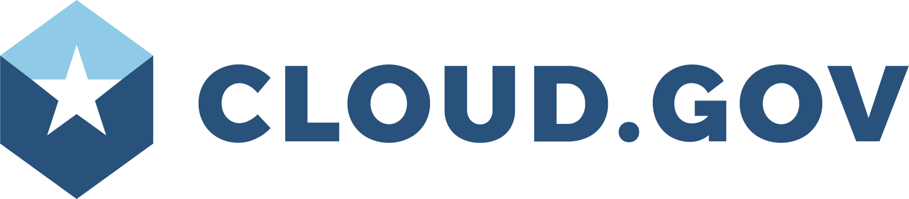
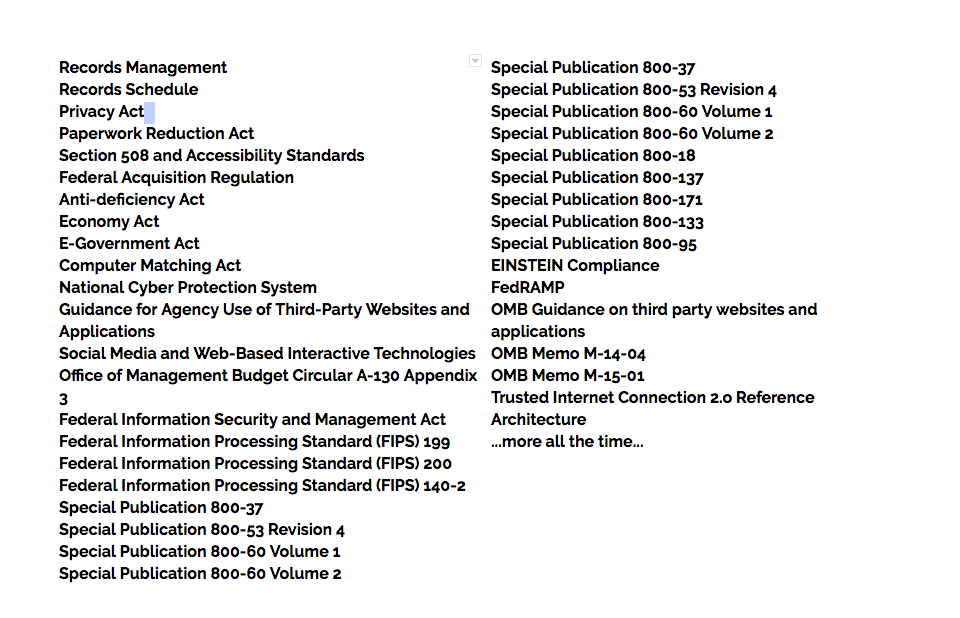
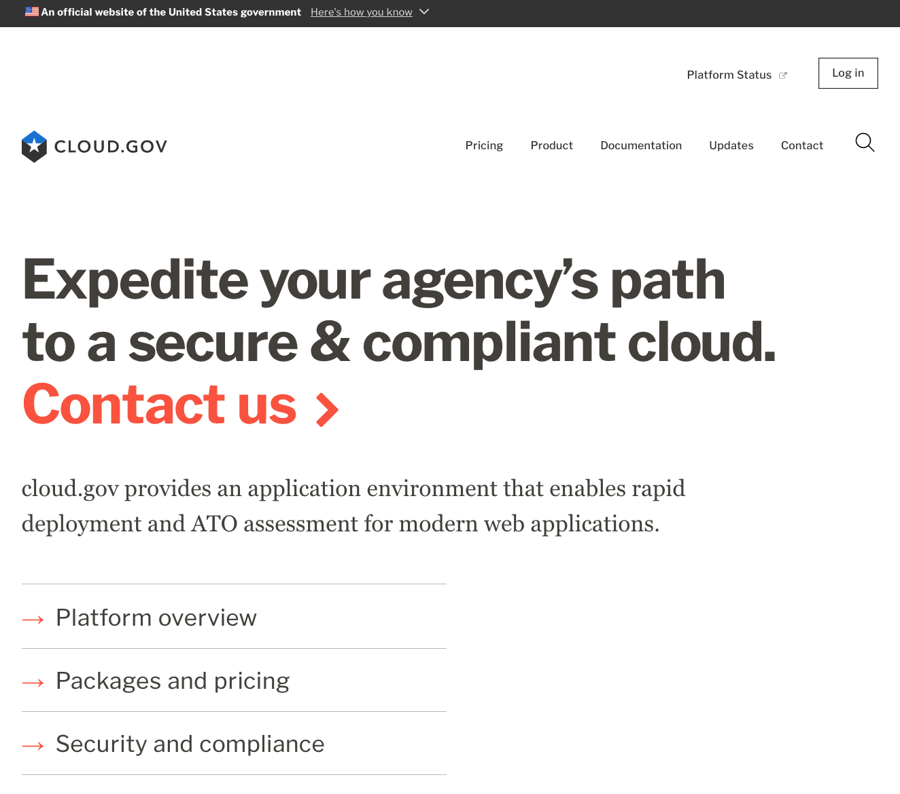
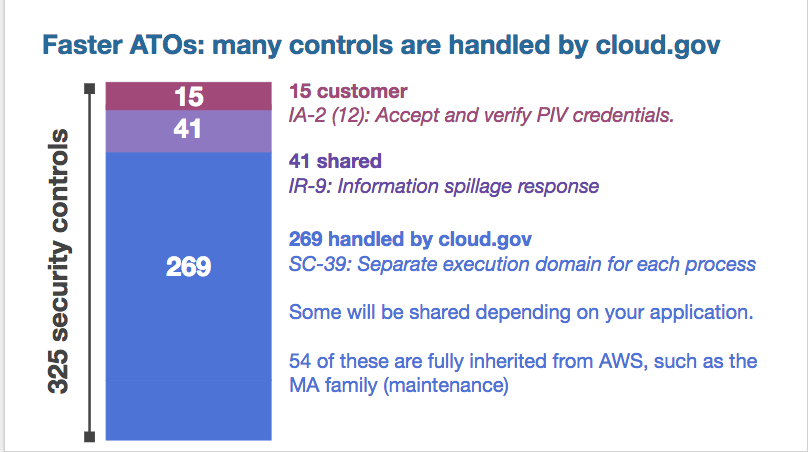
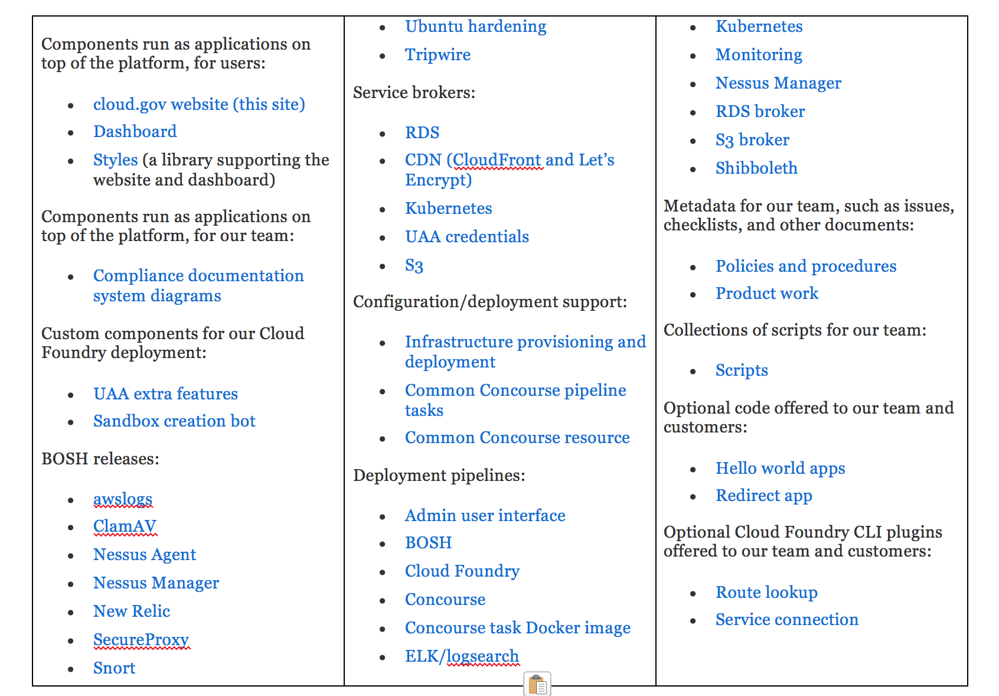
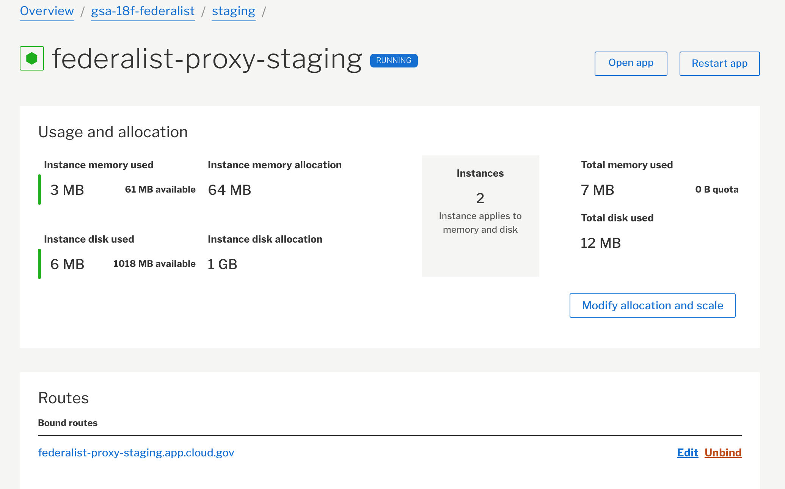
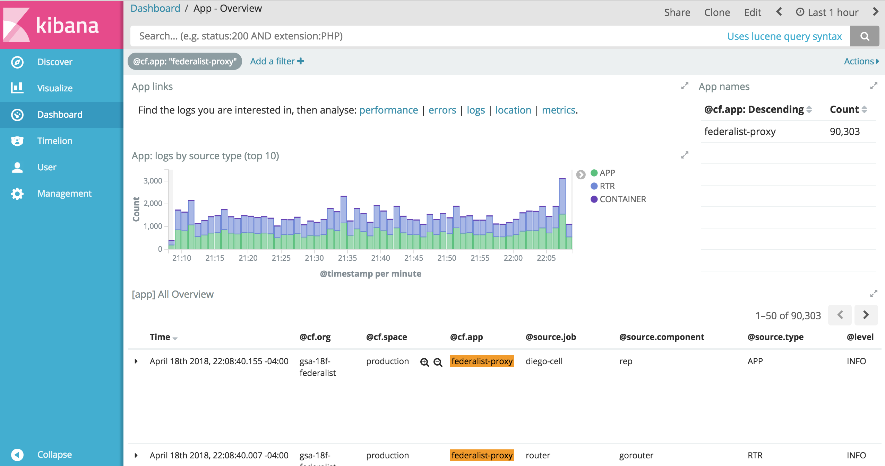
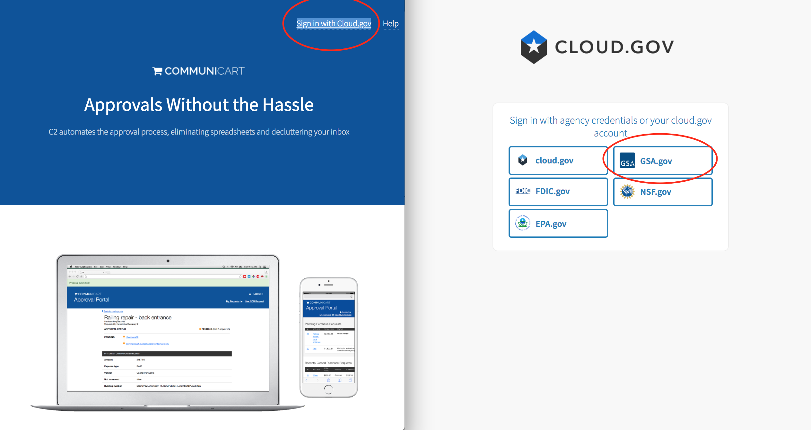
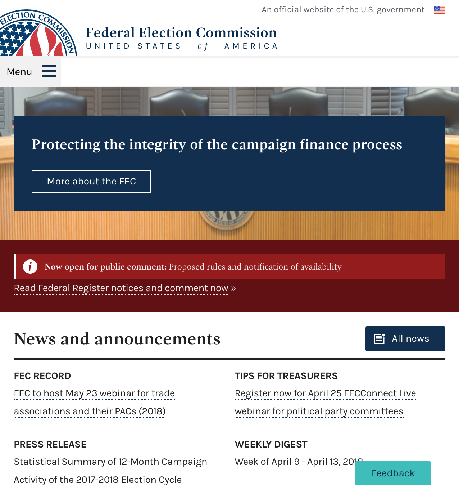
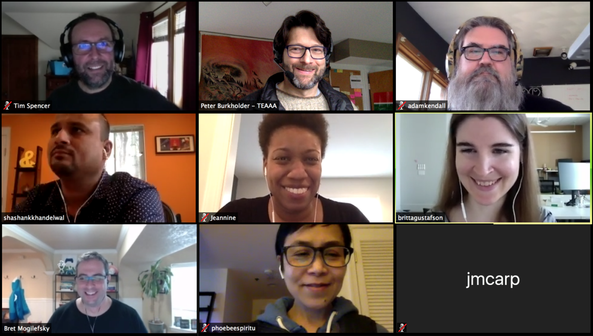

theme: next,1
footer: 
build-lists: true
slidenumbers: true

# Enabling Innovation in Government with Cloud Foundry
## Peter Burkholder

[.background-color: #FFFFFF]
[.header: #28517c]
[.hide-footer: true]

---

# `#hi`

^Hi. I'm Peter Burkholder, with cloud.gov, I spend most of my days working to help federal agencies adopt cloud.gov, and explaining what it means to work in Platform-as-a-Service.

^So it's exciting to be with folks who already understand Cloud Foundry, and may already  be using it government or in their own highly-regulated setting. 

^To understand cloud.gov and its mission, let's talk about the key ingredient to working effectively in technology: Trust

---

# Trust

* Psychological Safety
* Team Empowerment
* Regulatory Setting

^We know from research on team productivity and DevOps practices that the best outcomes are built on teams with a high-level of psychological trust, and when teams are empowered, are entrusted, to deliver value from concept to production.

^Now these are two different kinds of trust. 1! One is internal to a team: trust that your voice is heard, trust that you can fail without blame or shame. The other 2! is team context: Are they trusted to operate in their domain of expertise? Do they trust that failure will be treated as a learning opportunity and not cause for punishment? 

^This latter form of trust is very much in tension with a 3! regulatory setting. And within government, trust can be rare by design: 

---

[.hide-footer: true]

^our constitutional system is predicated on the populace not trusting the government, on the three branches providing checks on the others' powers. Procurement is set up to not trust the people making the buy to avoid favoritism. Nor to trust the contractors themselves.

^So Trust is replaced by regulation and audit; and this is fine -- it enables a bureaucracy to operate on behalf of the people.

<!-- ^Still, it can feed regulatory escalation: A loophole exists, it's exploited, resulting in scandal. The response is to write more regulation. And so on. -->

^Now, the regulatory framework for tech in the Federal government is the "Authority to Operate" process. Any US Government information system, like a web application, must be granted an Authority to Operate, or ATO. The ATO documentation runs between 200-1000 pages, to address all these published regulations:

---

#  
## Total 
## pages: 
## ~6600

[.header: #EE0000, alignment(right)]

^So three years ago, 18F was in a quandary. 18F is a digital consultancy housed within the GSA, and we partner with other agencies on innovation starting from principles
including user-centered design, agile development, lean acquisition and open-source practices. 

^So in conjunction with agency partners they were building great product. Yet the challenge of complying with and _documenting_ compliance was leading to product getting stranded, ....

---

[.footer: https://www.flickr.com/photos/martijnmunneke/3417016257]

^because they were looking at a process where typically...

---

[.footer: https://www.flickr.com/photos/martijnmunneke/3417016257]

### 6 to 14 months to ATO

^... it would take 6 to 14 months to obtain an ATO and actually ship. And that's when the cloud.gov began to coalesce.

---

# Genesis
[.header: #FFFFFF]

^One shortcut to ATO: Reuse! But in January 2015 the reuse of configuration management tooling wasn't scaling to the needs of the 18F, so after assessing the  tradeoffs between the available cloud and commercial offering, a small team at 18F  built a PaaS w/ Cloud Foundry that would satisfy the majority of the compliance implementation and documentation needs 18F and their partners.

^It was such a success internally, that folks decided to make it available to any agency, and in October 2015,

---

^ cloud.gov was launched for federal users. And if you we're present at the 2015 or 2016 CF summits, you may have caught Diego or Bret talking about cloud.gov. This is how it looked back then, but its been awhile, and a lot is new.

---

^A new look clearly, but a lot more under the covers. And we'll get into that, but since I wasn't around in those early days, I'd like to share the lessons I learned on my journey to being a true believer not just in cloud.gov, but in the paramount necessity for a high-level PaaS in highly-regulated environments.

---

# From digging to DevOps

 

^I came up through technology first as a geophysicist, doing field work and data analysis, and then as a sysadmin for research labs and the private sector. I caught the DevOps bug in 2010, as soon as I heard about it, as it pulled together the work I'd been doing with automation and testing, and with the framework for team collaboration.

^Before joining the US Government, I'd spent two years with Chef Software, where I'd spent time coaching around DevOps practices, with automation at the core. I struggled to nurture DevOps in regulated industries, though, and would see weird antipatterns emerge when different teams wouldn't trust each other's use of the tool.

---

# 18F

^ I hadn't fully cracked that trust question when I started with 18F. I admit now to being dismissive of cloud.gov at first: "It's just Heroku for government. It can't tackle serious problems -- thats for real sysadmins and their DevOps toolkit" 

^Then my first engagement with 18F was with an agency making their first concerted effort to work in a cloud. Instead of coaching I was down in the trenches with the agency partner to build a hardened, functional and automated development environment in Azure. In 9 months we didn't get to running a single line of developer code in that env, but where I felt disappointment, they felt we "had exceeded all expectations" by having a repeatable process for building and managing that environment. 

^Which was a real step forward for them, but meanwhile, I saw my colleagues at 18F shipping and releasing with their partner agenices using cloud.gov. I joined that team with two lessons that were crystallizing. They, are, first:

---

# 1: A PaaS is a prerequisite for DevOps outcomes in regulated environments

^So Everybody wants the DevOps. They read about the high performing organizations that move with speed _and_ stability. Then they focus on the tooling and the forms of DevOps, and lose sight of the outcomes.

^Core to DevOps is having teams empowered to deliver value, to deliver on mission, without bottlenecks. In smaller start-ups, in mature DevOps organizations, it might work to embed ops expertise in each team, and grant those teams the authority to make changes on behalf on the organization.

^Yes: you can run terraform to build a new test env. Yes: you can run that Chef recipe to install Tomcat.

^But as we discussed earlier, government and regulated industries are low-trust organizations. Even with Infrastructure-as-Code -- the same developer team they trusted to write code handling credit card data, they wouldn't trust to write code to install Tomcat on their systems.

<!--When I worked for Chef Software, I would see organizations with multiple Chef runs: One for ops and security, and one for the developers. 
-->

^As you probably know: that leaves product teams and developers begging: please can I just an app server and db server in a shared env, and has the ops teams working hard as ever.

^A PaaS is a prerequisite for DevOps outcomes in government. 

---

# 2: Absent a real PaaS, organizations will attempt their own

^You have these mature automation tools, you want guardrails for product and dev teams, it's tempting to build a toolchain bespoke to the organization's needs.

^Whether it's intentional or not, the drive of "let's build our own PaaS" takes hold. 

^This might take the form of something like: "I know, let's kick of the process with a Remedy ticket, which opens up a Puppet/Chef/Terraform template they can fill in, and commit to Git. The PR gets routed to Pat or Steve for approval, then it'll get instantiated in a validation environment for security scans ... " and so and so on. 

^Toolchains are awesome, but not at scale in an organization that hasn't practiced flow. Time and again, in the public and private sector, I've seen this devolve into Platform-as-a-Concierge-Service (or PaaCS), with bottlenecks accruing where manual work has to occur. And folks are still waiting.

^I want to stop this. So I want to make easy and obvious to use PaaS for the 80% use case, and let operations teams use the other tooling for the remaining hard work. And cloud.gov offers me that opportunity.  Now, what is this cloud.gov thing?

---

# What is cloud.gov?

* Cloud Foundry, 100%* open-source
* Standard buildpacks, brokers for RDS, S3, ES, Redis, etc.
* Running atop AWS GovCloud
* Only for US government
* Security by convention
* With a dollop of compliance:

^We, of course, offer the core functionality of Cloud Foundry: the ability to run application code for you in the cloud, We're 100% opensource. Now There are Commercial security tools in our boundary But nothing in our functional support.

^ along with self-service managed marketplace offerings. 

^Anyone from the US Gov can work in a free sandbox. But we're only for USGov use at this point; expanding to states and localities isn't in the picture at this point. 

^We enable tenant security by making the secure choice the default choice. By enabling self-service resources with sane defaults, product teams can focus on source code and functionality. Example: S3 buckets... 

^From a government perspective, our killer feature is security and compliance, first among this is FedRAMP authorization.

---

# Compliance

FedRAMP JAB P-ATO, FISMA Moderate, January 2017.

^Let's unpack that:

---

# Let's unpack that

* FedRAMP
* JAB
* P-ATO
* FISMA Moderate
* January 2017

[.build-lists: true]

^First, we're FedRAMP JAB authorized for workloads up to FISMA moderate. 

^At an agency, you can obtain from FedRAMP our entire System Security Plan and compliance findings. You don't have to do you own technical audit, that's been done. From those docs, you determine whether our security posture fits your needs, and how you want to inherit those controls.

^What this gets us for our tenants is a sign lift of their compliance load.

^August 2016: Began our review with the JAB teams. 23 weeks from JAB kickoff to signed P-ATO, including 8 weeks for technical/operational improvements and 15 weeks for JAB review. 470 pp, fortnightly meetings, monthly conmons, annual reassessment.

---

[.hide-footer: true]

^As mentioned, if you're running a FISMA-moderate workload, your security plan needs to address 325 controls and if you're building atop a typical IaaS, you could inherit and reuse ~100 controls. Physical env, physical security, media protection, perimeter security, maintenance. About 225 is on you. 

^When you run atop cloud.gov, you can inherit and reuse up to 269 of those controls, and then you have 56 which are shared or fully your responsibility. And I note we've leveraged FedRAMP ourselves by building atop AWS GovCloud, and inheriting of their 54 controls in our own SSP.

^These numbers are highly idealized!

---

# FedRAMP: What we learned

* Reflection
* Discipline
* Empathy
* Communication

^ Definitely good for our customers.
^ Reflected on what we offered, and yanked some features....
^ Discipline we would want to have regardless. We do quarterly reviews of our plans and processes, and are continually improving. 
^We better understand the our customers regulation efforts.
^ We got better at explaining what cloud.gov does, and how it works, and the value of open source.  

---

# Open source  all-the-things

<!--[.header: #FF0000]-->

^All our work is open source, it means this it's out there for you to use.  There's a lot of it - the background image lists a bunch of them. I'll highlight a few that are essential or useful.

---

# Dashboard

^Orgs, spaces, user invites, the broker marketplace, managing env var, stop/start and scale application, and other features.

^Mostly focussing on the non day-to-day non technial users.

^Australia contributions, Stratos likely will replace.

---

# UAA-authenticated Kibana plugin

^We store customer logs with ELK for 180 days, but stored logs aren't much use if you can't view them. So any cloud.gov use can authenticate against UAA and see their logs, and their logs only, in Kibana. 

^Adam Kendall on our team wrote a UAA plugin for Kibana, so once authenticated all user searches are filtered to include the @cf_org_id and @cf_space_id. Not just useful, but another step forward in making it easier to operate in compliance

---

# UAA identity provider broker

^Since we were already using our customer's agencies single-sign-on with UAA, why not make it easier on developers to enable agency authentication in their apps by just reusing that service?

^The cloud.gov identity provider service has a single oauth-client plan, and you provide the redirect URI and scope. The applications can then get the credentials to your provider via a service key. 

^I've shown one example here -- the system I used to request buying my workshop registration, requests.18f.gov, which is built to redirect me to the ageny SSO, and then I'm authenticated and ready to work.

---

# Behind the scenes

* Lots of BOSH Releases
* Terraform plans and Concourse pipelines
* Bug Bounty

^ 1, 2, 3

^Set aside money for bounties, paid very little, did get notified on a few things to tighten up, mostly feedback that they were impressed by our work.

^So 18F made _cloud.gov_ to change how agencies operate. How has that worked out? Here are our most active partner agencies, 

--- 

# Making a difference

Agencies: |   |  
---|---|---
NOAA | Air Force | Forest Service
FDIC | Education | IRS
FBI | EPA | OMB
NSF | USDS | ATF
**FEC** | **Interior** | **GSA**

(plus 71 agencies in sandbox orgs)

^ spanning broadly across government. NOAA, AirForce... 

^One good case study is the Fed Elec Commission. 

---

# Federal Election Commission

> **We had a complete culture change about how to do user-centered design and agile.**
-- FEC product owner

^The case study on our site focusses on cost savings, and in a small agency it matters that they save 85% on operation. But cloud.gov was also key to process transformation. As the product owner says:

^Agile from inception to delivery. Instead of quarterly releases, they now deliver bi-weekly, and are engaged in user-centered design and rapid prototyping. 

^They're not the only agency that has realized cost-savings, and better capacity, and  delivery on their mission. Dept of Education and College Scorecard; the FDIC; The Forest Service; have all seen cloud.gov as a key component of transformation.

^And sometimes it's the little things that matter, like our fourth graders:

---

^Who can now get free passes for our federal lands and waters Thanks to the Every Kid in a Park Program. 

^This site was tied to a scheduled presidential announcement date, and it turns out that those dates are fixed once they're set. With a 90-day deadline on the line, 18F partnered with Interior to design, build and launch it in time for the announcement. 

^And it turns out the static sites have been an overlooked need for federal offices.

---

[.hide-footer]

^Many offices just need a static website they can update as needed. CMS's
are overkill for them, so our sibling project Federalist lets people edit locally, push to GitHub, preview on the web, and then publish.

^Federalist now hosts 119 sites for eight federal agencies, and updates are happening hundreds of time per week.

^More generally Within GSA, many of our products are now built for cloud.gov, and we have team adept at generating the require documentation, and at working with our auditors.   Remember 6-14 months to ATO?

---

#  
#  
#  
#  
#  
#  
# 1 month to ATO

[.header: alignment(right)]

^As the auditors are also now familiar with cloud.gov, this ATO Sprinting Team can now obtain ATOs in about a month.

^All this has us looking forward to 

[.footer: https://www.flickr.com/photos/robwallace/784286985]

---

The road ahead: |   
---|---
FedRAMP High | Windows
CI/CD-as-a-Service | Container Runtime 
**Vendor Adoption** | **Multiple Clouds**

^All these things matter: 1,2,3,4

^As a government customer, you may be interested in a product that, as SaaS, is going to be hard buy because its not FedRAMP'd. ON the flip side, it may be time consuming and expensive to run "in-house". If the vendor certifies it runs in cloud.gov, then the gov customer can access better product in less time in their acquisition. Same compliance profile, smaller operational footprint

^And as Abby mentioned, many enterprises are running cloud foundry across multiple clouds. We aim to do the same for any Infrastructure that has a mature CPI support, and an appropriate authorization. This would yield huge benefits in Contingency Planning, allow workloads to run close to underlying services, and use the underlying provider with the best cost and feature offerings. Good for government, and good for competition. We expect to pilot that with Azure and Google Cloud this year.

---

[.background-color: #FFFFFF]
[.header: #28517c]
[.hide-footer]
[.slidenumbers: false]

^Technical excellence in highly regulated industries, and government, has challenges
around trust, which makes systems that enable higher-trust real enablers.

^We' demonstrated that with cloud.gov, and by moving forward with cloud.gova as a computer resource layer between government teams and underlying cloud providers, we can provide velocity and compliance and stewardship of tax dollars without vendor lock in.

---

  
  
 
# Thank you!

[.header: #EE0000;, alignment(center), line-height(0), text-scale(1.0)]

---

[.background-color: #FFFFFF]
[.header: #28517c]
[.hide-footer]
[.slidenumbers: false]

---

# References and Resources 1/2 

Mark Schwartz, How DevOps Can Fix Federal Government IT, https://www.youtube.com/watch?v=QwHVlJtqhaI, DevOps Enterprise Summit 2014

Jen Pahlka, "Death Star Thinking and Government Reform", Journal of Design and Science, https://jods.mitpress.mit.edu/pub/issue3-pahlka

cloud.gov repositories: https://cloud.gov/docs/ops/repos/

Characteristics of a PaaS: https://csrc.nist.gov/publications/detail/sp/800-145/final

[.autoscale: true]

---

# References and Resources 2/2

Announcement of cloud.gov launch: https://18f.gsa.gov/2015/10/09/cloud-gov-launch/ 

Prior CF summit talks: https://schd.ws/hosted_files/cfsummit2016/13/CFSummit2016-cloud.gov-compliance.pdf

Kibana Auth: https://github.com/cloudfoundry-community/logsearch-for-cloudfoundry/tree/develop/src/kibana-cf_authentication and https://github.com/cloudfoundry-community/logsearch-for-cloudfoundry/blob/develop/docs/features.md#kibana-authentication-plugin

[.autoscale: true]
