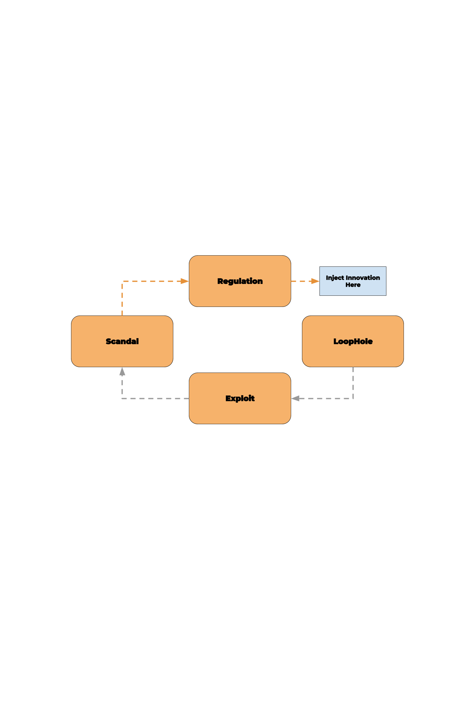

footer: @clouddotgov
slidenumbers: true
build-lists: false

# `#hi`

^Hi. I'm Peter Burkholder, with cloud.gov, I spend most of my days working to help federal agencies adopt cloud.gov, and explaining what it means to work in Platform-as-a-Service.

^So it's exciting to be with folks who already understand Cloud Foundry, about working with technology in government, and the joys and challenges of that work.

^To understand the mission of cloud.gov, and it's origins, lets reflect on why tech in government is challenging.

---

# Trust

^When you use some government websites, you may believe there's some truth to the notion that the government just can't do technology well. But what constitutes doing "technology well" in any environment, public or private? 

^We know from research on team productivity and DevOps practices that the best outcomes are built on teams with a high-level of psychological trust, and when teams are empowered, are entrusted, to deliver value from concept to production. In other words, that trust is the key ingredient to performance.

^But trust within government can be rare by design: our constitutional system is predicated on the populace not trusting the government, on the three branches providing checks on the others' powers. Procurement is set up to not trust the people making the buy to avoid favoritism. Nor to trust the contractors themselves.

^So Trust is replaced by regulation and audit. And this feeds what Brad Katsuyama dubbed 

---

# Regulated Industry Death Spiral

---

^A loophole or oversight exists, it's exploited, resulting in scandal. The response is to write more regulation. This bleeds talent, bleeds innovation, bleeds resources. So we're now more likely to miss a loophole, and the spiral continues.

^The regulatory spiral Specific to our domain is the ATO process. Any US Government information system, like a web application, must be granted an Authority to Operate, or ATO. The ATO documentation runs between 200-100 pages, to address all these published regulations:

---

## pages in total:
# ~6600

^We can't regulate our way out of this.

---

> You can’t fix the problem of a system that is based on rigid rules by specifying new rules.
-- Jen Pahlka 

^We can inject innovation

---

^Among the efforts to inject innovation, the last administration established the Presidential Innovation Fellow program in 2012, which led in 2014 to the creation of 18F: a digital consultancy within the federal government, housed in the General Services Administration. The team assembled there tackled problems by starting from user-centered design, agile development, lean acquisition and open-source practices. 

^But thanks to those 6,600 pages of regulation standing between their work and obtaining an ATO, their work was either stranded, or stuck. They simply couldn't ship.

---

[.footer: https://www.flickr.com/photos/martijnmunneke/3417016257]

---

[.footer: https://www.flickr.com/photos/martijnmunneke/3417016257]

### 6 to 14 months to ATO

^...because the time to obtain an ATO was 6 to 14 months. The shortcut to an ATO is to reuse technology that already satisfies most of those 6k pages. And cloud computing is a huge boon here, and we have what's called the FedRAMP marketplace

----

# The FedRAMP Marketplace

* Cloud Service Providers and JAB P-ATOs
* Compliance Control Inheritance
* A FISMA moderate System needs 325 Controls
* A typical IaaS: ~100 of 325
* Where's my PaaS?

[.build-lists: true]

^1. Cloud service providers can complete the FedRAMP authorization process, where the broadest authorization is a "Provisional ATO" granted by a "Joint Authorization Board."

^2. When an agency builds systems on top of that provider, they inherit compliance "controls" when then can, and build their town tooling and documentation on the remaining controls. But how many controls are there?

^3. For a FISMA moderate impact system, which can have PII, there are 325 controls to manage. Everything for data center locks and fire suppression, to which ciphers you have in use.

^4. If you build on an IaaS, you can inherit ~100 of those, the rest are "shared" or wholly on you.

^5. So where's the PaaS that can meet controls on OS hardening, and DB encryption, and log managements? In 2015, there wasn't one in FedRAMP. So the 18F answer was to build their own PaaS, satisfy as many of those controls as possible, and make that available for other agencies throughout government. Hence the birth of cloud.gov

---

^... which launched for federal users in Autumn 2015. And if you we're present at the 2015 or 2016 CF summits, you may have caught Diego or Bret talking about cloud.gov. It's been awhile, and a lot is new.

^Let's do quick tour of what cloud.gov offers.  We, of course, offer the core functionality of Cloud Foundry: the ability to run application code for you in the cloud, along with self-service managed marketplace offerings. From a government perspective, our killer feature is security and compliance.

---

# Compliance and Security

1. FedRAMP JAB P-ATO

^First, we're FedRAMP JAB authorized for workloads up to FISMA moderate. 

^At an agency, you can obtain from FedRAMP our entire System Security Plan and compliance findings. You don't have to do you own technical audit, that's been done. From those docs, you determine whether our security posture fits your needs, and how you want to inherit those controls.  

---

# Compliance and Security

1. FedRAMP JAB P-ATO
2. Control Inheritance

^Second, because we're platform-as-a-service, instead of infrastructure-as-a-service, a tenant can inherit a far larger number of security and compliance controls. 

---

^As mentioned, if you're running a FISMA-moderate workload, your security plan needs to address 325 controls and if you're building atop a typical IaaS, you could inherit and reuse ~100 controls 

^When you run atop cloud.gov, you can inherit and reuse up to 269 of those controls, and then you have 56 which are shared or fully your responsibility. And I note we've leveraged FedRAMP ourselves by building atop AWS GovCloud, and inheriting of their 54 controls in our own SSP.

--- 

# Compliance and Security

1. FedRAMP JAB P-ATO
2. Control Inheritance
3. Security by Convention

^Third, we enable tenant security by making the secure choice the default choice. By reducing cognitive burden at the platform level, product teams can focus on security in their source code. One Example: S3 buckets are either public or private, and that's that, reducing the chance stashing private data in a bucket that is later accidentally exposed. A few others: S3 buckets enforce server-side encryption. DBs are encrypted at rest, and only allow TLS connections. And so on.

---
# Compliance and Security

1. FedRAMP JAB P-ATO
2. Control Inheritance
3. Security by Convention
4. Continuous Improvement

^Lastly, we're because we're a built-for-compliance offering, we're always looking for ways to make compliance easier on tenants. I'll encourage you to tune in to Bret's talk for what's really new on that front. That's how we support our tenant's compliance and security, what is we've built?

---

# Open source  all-the-things

^In short, cloud.gov is Cloud Foundry running on AWS GovCloud, with tooling to keep it fully automated, and enhancements for four federal customers. All our work is open source, it means this it's out there for you to use. Let's take a quick 

---

| Customer facing: | |
| --- | --- |
| **cloud.gov Dashboard** | **CDN Broker for CloudFront + LetsEncrypt** |
| **Kibana proxy to customer logs** | Identity Broker to reuse UAA for applications | 
| Notify tenants on outdated buildpacks |  RDS & S3 Brokers | 
| Redis & Elasticsearch Brokers for K8S | Free Sandbox accounts | 

---

| Infrastructure/Bosh |   |
| --- | --- |
| BOSH: Ship audit logs to CloudWatch | BOSH: PowerDNS for DNSSEC support |
| BOSH: ClamAV, Nessus, NewRelic | BOSH: Tripwire, Snort, Ubuntu hardening|
| Sandbox-bot: 90 day sweep-up|  NGINX `secureproxy`  |
| Terraform plans | Concourse pipelines |
| **Ephemeral Jumpboxes** | **BugBounty** |

^So, what's come of all this work?

--- 

# Making a difference

^The folks at 18F originally adopted Cloud Foundry to solve their delivery problem, they made into _cloud.gov_ to change how agencies operate. How has that worked out?

---

Agencies: |   |  
---|---|---
NOAA | Air Force | Forest Service
Interior | Education | IRS
FBI | EPA | OMB
NSF | USDS | ATF
**FDIC** | **FEC** | **GSA**

(plus 71 agencies in sandbox orgs)

^The most active agencies, let's talk about three:

---

# Federal Election Commission

> We had a complete culture change about how to do user-centered design and agile.
-- FEC product owner

^The case study on our site focusses on cost savings, and in a small agency dropping their reducing their $1.4M/annum spend by 85% made a real difference. But I've been more interested in the process and culture change where they could adopt Agile from inception to delivery. Instead of quarterly releases with high change fail rate, they now deliver weekly, and are engaged in user-centered design and rapid prototyping in their endeavor to move the filing system to cloud.gov, not just public view.

---

## Federal Deposit Insurance Corporation

^FDIC migrated their main public website to us in March 2017, depending on our reliability especially for the Friday afternoon publication of bank seizures.  FDIC now sees us a core to modernizing and realizing the benefits of agile practices, and they are now prototyping a number of different systems on cloud.gov for eventual use in production.

^And they've adopted a great cloud foundry mentality, having written their own "Compliance Bot," a separate task worker periodically grab audit data, ship to S3, rotate service keys, do backups, and validate user roles. 

---

# Federalist 

^Many offices just need a static website they can update as needed. CMS's
are overkill for them, so our sibling project Federalist lets people edit locally, push to GitHub, preview on the web, and the publish.

Federalist now hosts 119 sites for eight federal agencies.

---

# (dry run: imagine an image of speedboat
# 1 month to ATO

^Within GSA, many of our products are now built for cloud.gov, and we have team adept at generating the require documentation, and at working with our auditors. As the auditors are also now familiar with cloud.gov, this ATO Sprinting Team can now obtain ATOs in less than a month.

^All this has us looking forward to 

---

The road ahead|   
---|---|
**Multiple Clouds** |  Windows
CI/CD-as-a-Service | Container Runtime 
FedRAMP High | **Adoption, adoption** 

^All these things matter: Windows, CI/CD, getting the upstream Container Runtime for K8s, and moving to FR high. Of particular interest: multiple clouds: Getting workloads perhaps closer to other services, and not just in a monoculture.

^Mostly, though, we're wanting to build adoption.  Agencies know they must modernize. They needs speed and stability. We want agencies to deliver on their mission with speed and stability, in way that doesn't involve vendor lock-in. But cloud.gov, or any PaaS, is a different beast, and the barriers to adoption are less technical than they are cognitive and cultural.

<!-- 14m 15s to this point -->

---

# Clearing the five barriers to adoption

^Let's look at five barriers that I've seen, as you'll likely encounter the same when working with your colleagues, your internal organizations, or your clients. I have some suggestions for getting past them, I would love to engage you all later on perhaps better ways to clear these.

---

# 1. The ☁️ is someone else's 💻
## ("compute", not "computer")

^I deeply regret ever saying "The cloud is someone else's computer" in a general intro talk. Although that saying is cute, and true, it points to a persistent mental model of thinking about "computers" instead of "compute".

^People today visualize their servers humming in racks in their datacenter. When you think of the cloud as someone else's computer, you'll picture virtual servers humming in virtual racks. You can make a one-to-one mapping, and miss all the real benefits of cloud computing.

^A typical example: A potential customer shared a quote from an IaaS contractor. The quote spelled out, for each of their environments, the number of CPUs and GBs RAM, for every server including the Varnish caching server, the NginX web server, the Redis server, and the DB Cluster itself. There was no mention of manage DB services, or scaling groups, or managed load balancers, let alone the cloud value add of automation, elasticity or disposability.

^The best I can do at this point is to talk the mission-enablement provided by the code that's bundled in, say, a J2EE WAR file. That code, running in production, is what provides value. 

^Then consider all the bits in an IaaS needed to run that WAR file: VPC, jumpbox, server, OS, Java install, J2EE runtime, scaling group, load balancers, SSL certs, etc. Not to mention what the deployment process is going to be. None of that provides value as such. Only what runs in the WAR. With cloud.gov, you provide the WAR, and the platform takes care of the rest.

^But clearing that mental model wall brings us crashing into:

---

# 2. The broken mirror

^The people I talk to, when they look in the mirror, see someone who has years or decades of experience running datacenters, spec'ing out hardware, configuring routers, and learning various operating systems. What we propose can be really threatening to their identity. We're not taking away their worries, we're taking away their sense of self. 
^This is Particularly so if there's an mandate coming from on high. And this core identity issue won't be expressed openly, the speaker may just see their objections as fully rooted in the org's best interests.

^What I'm finding is that it works to shift the conversation to all the things the PaaS or Automation doesn't do. The PaaS won't run every application. The applications that aren't cloud-ready need their expertise to get them to cloud ready. The PaaS is still dumb: it doesn't know how to scale your application. It doesn't know what to do with the logs it ships you. That's still on you. And the PaaS doesn't do all the things you've been wanting to do but never had time for: real CI/CD, meaningful dashboards, sensible alerting so you can sleep through the night, or finally getting the developers the tools they need.

^The broken mirror has one particular form that needs to be called out as its own barrier. Namely, when a lot of work has been invested, and we're told: "we already have a PaaS"

---

# 3. ✅PaaS 
## (or a PaaCS?)

^I see this when an organization is already investing in automation. They see private industry using Terraform/Cloudformation and Chef or Ansible, they adopt these too, and then the "let's build our own PaaS" fever takes hold. 

^For example: "I know, let's kick of the process with a Remedy ticket, which opens up a Puppet/Chef/Terraform template they can fill in, and commit to Git. The PR gets routed to Pat for approval, then it'll get instantiated in a validation environment for security scans ... and so and so on. 

^Toolchains are awesome, but not at scale in an organization that hasn't practiced flow. Time and again, in the public and private sector, I've seen this devolve into Platform-as-a-Concierge-Service (or PaaCS), with bottlenecks accruing where manual work has to occur. And cloud.gov hits the Not Invented Here syndrome.

^The agencies I talk with are interested in Lean, are interested in experimentation. Since cloud.gov is outside an organization's ecosystem, It doesn't threaten the PaaCS if one pilot system moves to it. And when it works, when we can talk about short lead time and number of releases, then we can tackle risk perception.

---

# 4. Too risky  🎲🎰🎲🎰
## (status quo bias)

^People ask, "Is cloud.gov secure enough?" Important question, but a better framing is: "Where will my security be best — in cloud.gov, or in my data center, or in an IaaS using a new and unfamiliar toolset?"

^Generally, its best to minimize your attack surface, by using the highest level compute abstraction you can. Saas over PaaS, PaaS over IaaS. 

^But we prefer known risks to new ones. We are prey to the "status quo bias," a cognitive bias to resist change and prefer the current state of affairs, and to discount the advantages change brings. 
Quantifying risk, quantifying all the hypotheticals is hard, and that's when the status quo bias will nudge people to the shortcut of saying: No.

^To counter this, I'm experimenting more with talking about cognitive biases, with the angle that the people I'm talking to are wise enough to step back and weigh matters objectively, and move past that bias.

^We also need to account for risk budgets: Risk is never zero, and at some point you must deliver on your mission.  cloud.gov enables mission delivery like few other tools available to the federal government.

^The last barrier is: We don't need a PaaS, we have a DevOps team.

---

## 5. 🚫 PaaS  (we have a DevOps team)

^Everybody wants the DevOps. They read about the high performing organizations that move with speed _and_ stability. Then they focus on the tooling and the forms of DevOps, and lose sight of the outcomes which should be paramount. 

^Core to DevOps practice is having teams empowered to deliver value, to deliver on mission, without external bottlenecks. In private industry, in smaller start-ups, in mature DevOps organizations, it may be feasible to embed ops expertise in each team, and grant those teams the authority to make changes on behalf on the organizational goals.

^But as we discussed at the beginning of this talk, government and regulated industries are low-trust organizations. When I worked for Chef Software, I would see organizations that would have multiple Chef runs: One for ops, one for security, and one for the developers. Nevermind that they were practicing Infrastructure-as-Code -- that the same developer team they trusted to write code handling credit card data, they wouldn't trust to write code to install Tomcat on their systems. 

^So when folks insist they have a DevOps team, that might be awesome. But it often means they've created CI/CD and infra-as-code team that is, despite best intentions, just a bottleneck to value delivery, because now all changes have to go through that team, instead of trusting the people closest to the product.

---

# The PaaS to DevOps Outcomes

^In short, I believe that a PaaS is a prerequisite for DevOps outcomes in government. Without it, teams are unlikely to have the authority to create, change and delete resources, and there will be too many impediments to move with speed and stability. And that's what motivates us in cloud.gov:

---

[.background-color: #FFFFFF]
[.hide-footer]
[.slidenumbers: false]

^Technology in government is hard thanks to low trust, the regulatory death spiral, and that you can't rule-make your way out. Innovation is possible, but you need to automate compliance so you can focus on innovation. Cloud.gov paves the way to compliance and innovation, and is built with open source tools that you can leverage and learn from. The barriers now in the adoption of cloud.gov, or any highly-abstracted compute platform, are not technical so much as cognitive and cultural; so I hope that some of what we've observed will help you overcome similar obstacles in your path forward.

---

 
 
 
# Thank you!

[.header: #FFFFFF]

<!-- 8m 11s + 14m 15s = 22m 30s -->

---

# References and Resources 1/2 

Mark Schwartz, How DevOps Can Fix Federal Government IT, https://www.youtube.com/watch?v=QwHVlJtqhaI, DevOps Enterprise Summit 2014

Jen Pahlka, "Death Star Thinking and Government Reform", Journal of Design and Science, https://jods.mitpress.mit.edu/pub/issue3-pahlka

Brad Katsuyama, Regulatory Death Spiral. _N.B._ I've been unable to find this other than one photo of slide online. Thanks to Julian Dunn for bringing it to my attention, e.g., https://www.slideshare.net/chef-software/security-at-velocity-dc-cap-one

cloud.gov repositories: https://cloud.gov/docs/ops/repos/

Characteristics of a PaaS: https://csrc.nist.gov/publications/detail/sp/800-145/final

[.autoscale: true]

---

# References and Resources 2/2

Status Quo Bias: Mark Schwartz, March 2018: https://medium.com/aws-enterprise-collection/reducing-risk-in-the-cloud-by-overcoming-the-status-quo-bias-4a2459cca2ef and Daniel Kahneman, _Thinking, Fast and Slow_, 2013.

Announcement of cloud.gov launch: https://18f.gsa.gov/2015/10/09/cloud-gov-launch/ 

Prior CF summit talks: https://schd.ws/hosted_files/cfsummit2016/13/CFSummit2016-cloud.gov-compliance.pdf

Kibana Auth: https://github.com/cloudfoundry-community/logsearch-for-cloudfoundry/tree/develop/src/kibana-cf_authentication and https://github.com/cloudfoundry-community/logsearch-for-cloudfoundry/blob/develop/docs/features.md#kibana-authentication-plugin

[.autoscale: true]

---

<!-- 
Points I haven't made yet:
* DOD and JEDI and PaaS first
* Legitimacy (A. Clay Shafer)
* What about _The Outage_?  DevOps investment, failure happens, drill for it.
* ATO sprinting team successes
* How does Kibana work? :white_check_mark:
* Is cloudfront going away?

-->
