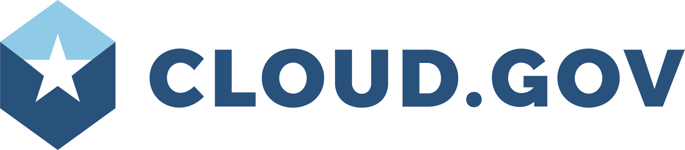

theme: next,1
footer:  @18f
build-lists: true
slidenumbers: true

# Enabling Innovation in Government with Cloud Foundry
## Peter Burkholder

[.background-color: #FFFFFF]
[.header: #28517c]
[.hide-footer: true]

---

# Cloud

---

# 2011-02-08: Cloud First

* Adoption lags....
* $85B, $2B on cloud (FY 2016)
* DOD JEDI first major buy to consolidate +4k DCs
* USDA COE effort to consolidate 38 -> 2 

---

# So not realizing benefits of:

* cost (capex/opex, sometimes savings)
* automation
* security
* mission focussed IT
  * lean/agile
  * innovation

---

# Uneven implementation

* naïve lift-and-shift
* re-implementing iron in the cloud
* high spend and low utilization

^ So not realizing benefits in cost, security, automation

---

# Mission-focussed IT

---

# Does IT matter?

* 2003: HBR Nicholas Carr: IT Doesn't Matter
* ... but then: DevOps
* 2014: Gartner --  BiModal IT
* ... but hi-perf IT orgs still out-performed

---

Lean/Agile in one slide

---

# 2014-2017: State of DevOps Reports

(image)

---

# Metrics

---

# Traditional IT Measures

* Lines of Code
* Velocity
* Utilization
* Uptime (ops)

^all of these have problems, but especially uptime

---

# High-performance Measures

* Release frequency
* Lead time (commit to release)
* % change fail rate
* MTTR
* SLOs

---

Example SLO / SLI

SLI: API responds within 500ms for 99% of users (observed, not synthetic)
SLO: SLI is met 99.97% of time per month (13m/month)

---

# Culture measures

* Westrum safety culture (aviation/healthcare)
  * 7 statements on Likert scale
* Generative: results-driven
* Bureaucratic: rule-driven
* Pathological: power-driven

---

# How to get there from here?

* Cloud / Automation
* Mission-focussed IT
  * Tax dollar stewardship
  * Better value delivery
* But: 
  * Months/year to procure/authorize
  * Lack of clear path

---

# Our path

* Nucleate 
* Authorization reuse (FedRAMP)
* Build at high-water mark
  * SaaS > PaaS > IaaS > DC

^ Rely on tech you don't manage yourself. Mission focus

---

# High water slides

---

# cloud.gov

* 2016: no FedRAMP PaaS for open-source frameworks

---

# Today

* everything is code
* everything is automated

---

# How to get there from here

* Agile procurement
* 1-button releases (or 1-slide)
  * No runbooks on critical path
* Everything in version control
  * Snover quote
* Product autonomy
* Measure and emit culture metrics

^  (Audit, control, collaboration, sharing, communicate) - not runbooks
