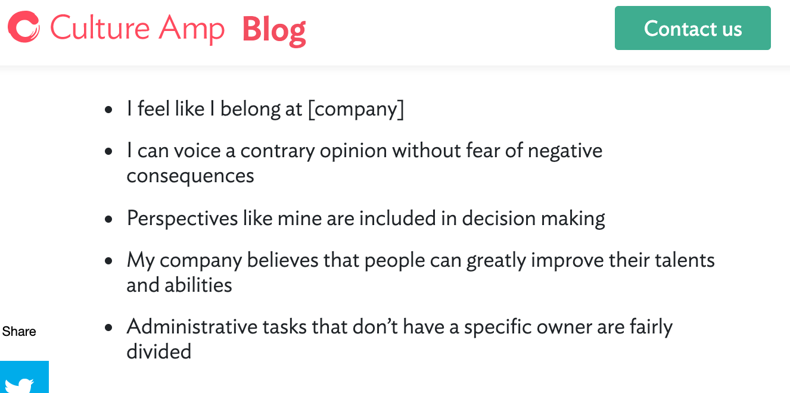

theme: Business Class, 5
slidenumbers: true
autoscale: true
footer: @pburkholder

# 🌱Culture is not Squushy 🌱   

## Peter Burkholder

## DevOpsDC, February 2019

### with tweaks for TTS DevOps Guild, May 2019

^A few weeks ago at work there was some discussion whether our group had the same values and drive as we did a few year ago, and I jumped in with what I thought was an obvious answer, namely:

---

# “Let’s measure our Westrum typology!”

---

#  `¯\_(ツ)_/¯`

^Suggested to mgmt that we do Westrum surveys', much like "Lets do coffee!" -- assuming a) universal knowledge and b) universal agreement. 

^So let's talk DevOps and Culture and History. Back in 2009, Patrick Debois organized the first Agile Infrastructure conference, and to harness Twitter's 140-character limit, he dubbed it DevOps Days, a term that we carry with us still. Since there's no DevOps Manifesto, DevOps has been defined variously be diff practitioners, but an early outline came from John Willis and Damon Edwards, namely:

---

# CA(L)MS (2010)

* Culture
* Automation
* (Lean)
* Metrics
* Sharing

^ and at that time John said nothing more about it other than: "People and process first.  If you don’t have culture, all automation attempts will be fruitless." Which may be true but isn't particularly helpful.

^ And for the next few years, I think culture in DevOps was squushy by people who applied a "you know it when you see it" mentality, but measuring it came more into focus as some rigor started to be applied to our DevOps attributes. A good example of this squushiness is provided by the first "State of DevOps reports"

---

# Puppet state of DevOps reports

* Key Players:
  * Gene Kim
  * Jez Humble
  * James Turnbull
  * John Willis
* 2012 Survey Data
* Presentation at _Velocity_, June 2013

---

## High Performing DevOps Teams (2012)

* They’re more agile
  * 30x more frequent deployments
 * 8,000x shorter lead time (minutes/hours vs. months/quarters)
* They’re more reliable
  * 2x the change success rate
 * 12x faster MTTR

[.footer: https://www.slideshare.net/realgenekim/2013-velocity-devops-metrics-its-not-just-for-webops-any-more]

--- 

## Measuring Culture (2012)

> “I’ll tell you EXACTLY what devops means. Devops means giving a shit about your job enough to not pass the buck. Devops means giving a shit about your job enough to want to learn all the parts and not just your little world. Developers need to understand infrastructure. Operations people need to understand code. People need to fucking work with each other and not just occupy space next to each other.” 
-- John Vincent | @lusis | http://bit.ly/12DkRhf

[.autoscale: true]
[.footer: https://www.slideshare.net/realgenekim/2013-velocity-devops-metrics-its-not-just-for-webops-any-more]

---

##  Measuring Culture (2012)

* Trust (and Verify)
* Continuous Improvement vs Risk Management Theater
* “Human Error”
* Heroes / "high performers

[.footer: https://www.slideshare.net/realgenekim/2013-velocity-devops-metrics-its-not-just-for-webops-any-more]

^ They identified that they need to measure culture, to identify High Mgmt Trust vs Low Mgmt Trust styles, and that they needed metrics that enable regression, using a "Likert-type scale"

^ until Nicole Forsgren starting working with Puppet on the State of DevOps Survey in 2013, and published their first report in 2014. She realized that you can't just go in and ask:

---

# How is your organizational culture?

---

# Nicole Forsgren

^ so the next SODOR including responding to these statements:

---

# On my team...

* information is actively sought.
* messengers are not punished when they deliver news failure or other bad news.
* responsibilities are shared.
* cross-functional collaboration is encouraged and rewarded.
* failure causes enquiry.
* new ideas are welcomed.
* failures are treated primarily as opportunities to improve.

# Rank from 1 (strongly disagree) to 7 (strongly agree)

^The 2013 survey introduced questions, which you were to rank on a scale from 1 to 7, with 1 being Strongly diagree and 7 being strongly agree

^These questions did not come out of vacuum. Indeed, they're directly from this 2004, paper:

---

[.footer: Westrum R A typology of organisational cultures BMJ Quality & Safety 2004;13:ii22-ii27.]

^You'll note, if you're sharp-eyed, that the journal is about business, or technology, but from the BMJ Quality & Safety. What does quality and safety have to do with DevOps?

^Jesse Robbins at AWS was a firefighter. John Allspaw of 10 + Deploys a Day at Flickr was pursuing a degree in  Human Factors and Systems Safety at Lund University. Sydney Dekker's work in avaition system was getting attention, as from this tweet:

---

^So when you're casting about for way to quantify DevOps culture, safety culture is good place to start. But it turns out there a lot of ways to measure how a workplace environment. First

---

# Organizational Culture

er# vs.

# Safety Culture

^Org culture like to talk about comp factors model, external & differentiation/internal & intergration vw stability + control & flexibility and freedom.  Clan/Market, Hierarchy/Adhocracy, from Quinn and Cameron, 1980s.

---

# A sampling of safety culture measures:

* *Competing Values Framework*: 65 questions, 1-5 ranking
* White & Wilson: 113 questions on a 7-point scale
* Team Climate Inventory: 44 items across 15 subscales
* Ostroff Organizational Climate Survey: 94 Items
* Zohar 2005: Only 16 questions, but:
  * “Considers safety when setting production schedule”
  * “Quickly corrects any safety hazard”
* [Gallup Q12 (paid only)](https://www.goalbusters.net/uploads/2/2/0/4/22040464/gallup_q12.pdf)
* Dimensions of Learning questionnaire

^ so if you can't subject a survey population to these, how can you query them to elict
which kind of organizational culture they're a member of 

^ I really dislike the CVF, with Clan Focus, Market focus, Hierarcy and AdHocracy (for flexibility and external focus)

---

# Ron Westrum, Eastern Michigan University

**Pathological organisations** are characterized by large amounts of fear and threat. 

**Bureaucratic organisations** protect departments. 

**Generative organisations** focus on the mission. 

[.autoscale: true]
[.footer: The Study of Information Flow: A Personal Journey; Westrum]

^People often hoard information or withhold it for political reasons, or distort it to make themselves look better.

^Those in the department want to maintain their “turf,” insist on their own rules, and generally do things by the book — their book.

^ How do we accomplish our goal? Everything is subordinated to good performance, to doing what we are supposed to do.

---

Pathological  | Hierarchical | Generative
-------|--------- | ----------
_Power-oriented_ | _Rule-oriented_ | _Performance-oriented_
Low co-operation | Modest co-operation | High co-operation
Messengers "shot" | Messengers neglected | Messengers trained
Responsibilities shirked | Narrow responsibilities | Risks are shared
Bridging discouraged | Bridging tolerated | Bridging encouraged
Failure leads to scapegoating | Failure leads to justice |Failure leads to inquiry
Novelty crushed |Novelty leads to problems | Novelty implemented

---

# Information Flow

* _*Suppression*_: Harming or stopping the person bringing anomaly to light
* _*Encapsulation*_: Isolating the messenger, so the message is not heard
* _*Public relations*_: Putting the message "in context" to minimize impact
* _*Local fix*_: Responding to present case, but ignoring possibility of others
* _*Global fix*_: An attempt to respond to the problem wherever it exists 
* _*Inquiry*_: Attempting to get at the "root causes" of the problem

[.autoscale: true]

---

# Case studies and anecdotes

<!--[left](https://media.giphy.com/media/1xnbsOCTvkna6xVIe1/giphy.gif)
-->

---

# ATR-72

* "There were five pre-Roselawn ATR-42 incidents that occurred in severe icing conditions"
  * But no global alert issued, due to heavy pressure from French aviation
* October 31, 1994, American Eagle #4184 killed all 68 aboard
  
^A crash of an ATR-72 airliner in Italy, for instance, was carefully written up to avoid finger pointing, thanks to heavy pressure from the French aviation industry. The crash did not lead to a worldwide alert that the aircraft might have a mode, under certain conditions, that would lead to one of the wings dipping suddenly, and thus causing loss of lift. The failure to engage a global fix may have led to a second ATR-72 that crashed in Roselawn, Illinois.21 The encapsulation of the facts by the original accident report had a devastating result.

---

# What examples can you think of?

* GM ignition switch flaw: 124 deaths
* Toyota sudden accelerations: 89 deaths
* Boeing 737-Max: 346 deaths
* Equifax and struts patch: blame 1 person

---

> I sent the engineer a bottle of champagne because I wanted everybody to know that honesty pays off, even if someone may run the risk of incriminating himself. Absolute honesty is something you cannot dispense with in a team effort as difficult as that of missile development
--  

---

> I sent the engineer a bottle of champagne because I wanted everybody to know that honesty pays off, even if someone may run the risk of incriminating himself. Absolute honesty is something you cannot dispense with in a team effort as difficult as that of missile development
-- Werner von Braun 

---

> The true need is for a scheme that captures one or few dimensions in an easy to understand way
--- Ron Westrum

^ How do you measure culture. In his typology paper, Westrum lamented there wasn't a good tool for this:

---

# Likert scales

* Do you feel you can provide feedback to management and it will be genuinely taken into consideration?

Vs:

* I can provide feedback to management.
* My feedback will be genuinely taken into consideration.
  * 1 <-- Strongly disagree .... 4 .... Strongly agree --> 7

[.build-lists: true]

---

# [fit] Results

---

^ Lean mgmt from ADO is Team experimentation, working in small batches, gathering and implementing customer feedback

---

---

> Westrum organizational culture is highly correlated with _eNPS_  and that elite performers are 1.8 times more likely to recommend their team as a great place to work.

> In 2016, 31% of respondents were classified as pathological, 48% bureaucratic, and 21% generative.
--Excerpt From: Nicole Forsgren, PhD, Jez Humble and Gene Kim. “Accelerate.” iBooks. 

---

# Let's measure this! What could possibly go wrong?

* Scope to a team or unit
* Ask the seven questions, scoped to unit
* Analyse

---

# Questions to ask going into this

* What if there's bimodal/skew distribution?
* What if there's variance (lack of _convergence_) across questions? 
* What to do for _pathological_ results?

---

# Longitudinal considerations

* There's _very_ little written on this
* What about leading and lagging indicators?
* How will you separate climate from culture?

^Only data points I have are @andykalk and @chef

--- 

# How we did this in 18F engineering

* Amy Mok
* Alex Soble
* Peter Burkholder

---

# Selected questions from:

* DevOps Westrum Culture Survey
* Steven Huang, Culture Amp: [5 Diversity and Inclusions Questions](https://blog.cultureamp.com/5-diversity-and-inclusion-questions-to-use-at-your-company)
* Amy Edmondson, reWork at Google: [Questions to measure psychological safety](https://rework.withgoogle.com/guides/understanding-team-effectiveness/steps/foster-psychological-safety/)
* Past culture surveys from 2017 and 2018
* And our newly invented demographic measure:
  * "I identify as a member of an under-represented demographic in technology."

---

---

---

#[Results](https://docs.google.com/presentation/d/10bSoMODbOYAMOHw2KMnyF36A-6rfRUUH-qd3dyyqIsI/edit#slide=id.g586a8807f2_0_5)

---

# Recommendations (from Humble, et al)

* Run semi-annually or annually
* Make aggregated results available to all
* Ensure execs meet to discuss findings, next steps

^Disassociate culture surveys from pay and performance reviews. Make the aggregated results available to all employees and ensure executives set up meetings to discuss the findings and plan next steps. Run surveys annually or semiannually to provide a baseline for comparison and measurement of change over time.

---

# Pitfalls

* Comparing teams against each other
* Basis of pay or promotion
* “Your team doesn’t appreciate our culture”
* Cinderellas
> "Does the isolated generative unit become a Cinderella, the target of hostile jibes and political actions?"

---

# Your stories & questions

---

# Summary

* DevOps and the CALMS model
* No common criteria for culture, but DORA uses Westrum
* Information flow categorizes you as
    * Pathological | Bureaucratic |  Generative
* 7 criteria
* Lean & CD → Generative → SDO & Org outcomes
  * p < 0.05 confidence
* Use at your own risk

---

# “Let’s (not) measure our Westrum typology?”

## The paradox of leadership

---

# References 

Westrum, Ron. "A typology of organisational cultures." BMJ Quality & Safety 13.suppl 2 (2004): ii22-ii27.

Westrum, Ron. "The study of information flow: A personal journey." Safety Science 67 (2014): 58-63.

Forsgren, Nicole, Jez Humble, and Gene Kim. Accelerate: The Science of Lean Software and DevOps: Building and Scaling High Performing Technology Organizations. IT Revolution, 2018.

---

# References 2

Forsgren, Nicole, Gene Kim, Nigel Kerstnen, Jez Humble. "2014 State of DevOps Report" https://www.researchgate.net/publication/263198947_2014_State_of_DevOps_Report

 Willis, John. http://itrevolution.com/devops-culture-part-1/ - A Dive into Devops Culture

Kim, Gene, Jez Humble, James Turnbull, John Willis. "DevOps: It's Not Just For WebOps And We Have The Metrics to Prove It." Velocity Conference 2013 (slides). https://www.slideshare.net/realgenekim/2013-velocity-devops-metrics-its-not-just-for-webops-any-more

Humble, Jez, Joanne Molesky, Barry O'Reilly. _Lean Enterprise_, 2014, OReilly

---

# References 3

John Willis: https://blog.chef.io/2010/07/16/what-devops-means-to-me/ - 2010 first blog post on CAMS, following 2010 Mountainview DevOpsDays

Schulte, Mathis & Ostroff, Cheri & Shmulyian, Svetlana & Kinicki, Angelo. (2009). Organizational Climate Configurations: Relationships to Collective Attitudes, Customer Satisfaction, and Financial Performance. The Journal of applied psychology. 94. 618-34. 10.1037/a0014365. 

Zohar, Dov, and Gil Luria. "A multilevel model of safety climate: cross-level relationships between organization and group-level climates." Journal of applied psychology 90.4 (2005): 616.

