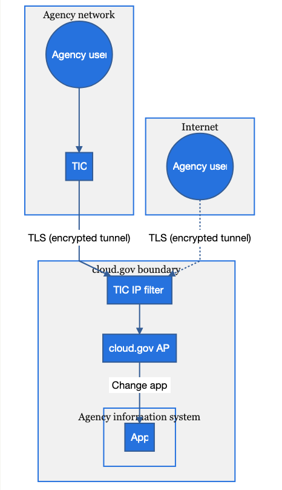
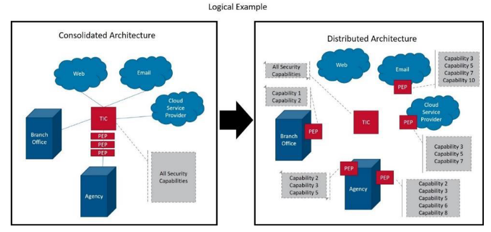
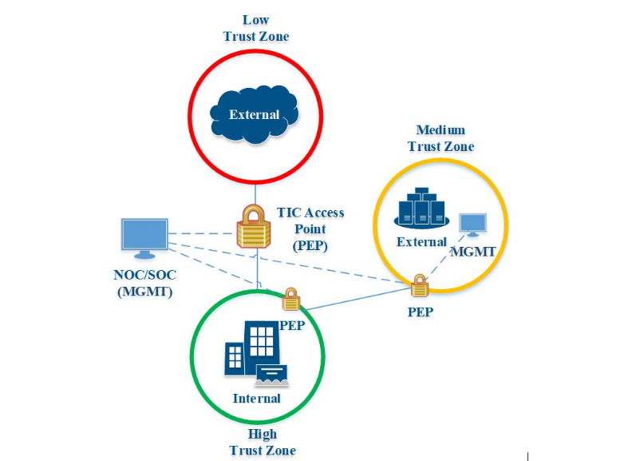

Theme: Next, 1
text: Libre Franklin, #53585F
text-strong: Libre Franklin, #EE783F
text-emphasis: Libre Franklin Italic
header: Libre Franklin Bold, #53585F
header-strong: Libre Franklin Black,#EE783F 
header-emphasis: Reklame Script, #53585F  
code: Fira Code Medium, #EE783F, #8B3D90, #2E59A2, #DF393F, #1EA8D9
background-color: #FFFFFF  
slidenumbers: true
footer:  
build-lists: true

# [fit]**TicTalk**
Peter Burkholder
TTS Security/Compliance Guild
2020-06-26

---

# The Email

> [Sean had] seen some commentary on cloud.gov's website around TIC that was based on the 2.0 Reference Architecture and could use updating.
-- Jay Huie

Sean is policy lead for TIC at DHS

^In early March I heard that the folks in the DHS TIC office though that cloud.gov's TIC compliance page was not keeping up with the the times. Indeed, it comes up short

---

---

# Resources
* [YouTube Video](https://www.youtube.com/watch?v=sQHde_YQPnI)
* [TIC site: https://www.cisa.gov/trusted-internet-connections](https://www.cisa.gov/trusted-internet-connections)
* [OMB Memo M-19-26](https://www.whitehouse.gov/wp-content/uploads/2019/09/M-19-26.pdf)
* [GitHub TIC3.0 Comments - https://github.com/cisagov/tic3.0/issues](https://github.com/cisagov/tic3.0/issues)

^I learned this morning that there are hundreds of comments, only 12 of them submitted as GitHub issues.

---

# Caveat

This is not a fair and balanced coverage of the TIC3.0 landscape

^As there's a Cloud Strategy meeting this afternoon, I'm only noting what I, personally, find interesting/compelling/problematic. This may be critical but my intent is to help you fill in the blanks during future conversations and perhaps nudge CISA in a more productive direction

---

# The Memo M1-19-26 Sept 2019

* Rescinded a bunch of memos, "a physical TIC access point ... has proven to be an obstacle [to cloud]"
* Required "TIC Use Cases" from DHS for alternative controls to a physical point
* Capabilities don't need to be tied to TICAPs or MITIPs. 
* TIC use cases to let agencies demonstrate secure scenarios

^In fact EINSTEIN NCPS is statutorily required to meet intrusion detection/prevention "_such as_ the .. EINSTEIN suite" (emphasis mine, noting that NCPS/EINSTEIN is not required)

---

# Memo Appendix - Use Cases

1. Traditional (default) ✅
2. Cloud
  * IaaS / PaaS / EaaS / SaaS 
3. Agency Branch Office ✅
4. Remote [Federal] Users

---

# The DRAFT 

* 8 Documents, December 2019
* Some omments at https://github.com/cisagov/tic3.0
* Next drafts in Summer 2020, not Spring

---

# [fit] What's new?

---

# PEPs

^ Security capabilities are dispersed to PEPs instead of just at TIC AP

---

# Trust Zones

---

---

# Multiple Telemetry Requirements

> TIC telemetry does not negate telemetry [for] NCPS & CDM
-- Vol 1, section 10

---

TIC Objectives

The objectives intend to limit the potential impact of a cybersecurity event. 

Manage Traffic
* Observe, validate, and filter data connections to align with authorized activities; least privilege and default deny
Protect Traffic Confidentiality
* Ensure only authorized parties can discern the contents of data in transit; sender and receiver identification and enforcement
* Protect Traffic Integrity
Prevent alteration of data in transit; detect altered data in transit
Ensure Service Resiliency
* Promote resilient application and security services for continuous operation as the technology and threat landscape evolveEnsure Effective Response
* Promote timely reaction and adapt future response to discovered threats; policies defined and implemented; simplified adoption of new countermeasures

---

# Universal Capabilities (Kitchen Sink)

These all seem to overlay to NIST controls for our systems.

---

Web Policy Enforcement

**This is only meant for CLIENTS**

"An environment used for web browsing purposes, hereafter referred to as Web"

---

No good guidance for providing secure services to the public

---

* Whither EINSTEIN?
* The P.E.P Talk
* cloud.gov & TIC

^ This is subtext that's likely not going to be covered in the 3pm talk, but we'll see