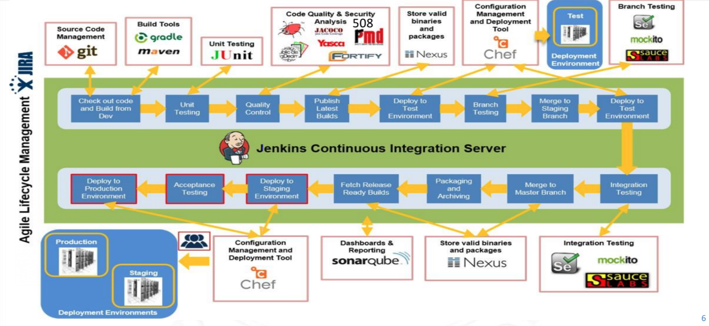

theme: Business Class, 5
slidenumbers: true
autoscale: true
footer: @18f
build-lists: true

# [fit]USGS/18F 
# [fit]DevOps Sharing
## 2 July 2019

---

# What is 18F?

---

# Minimum Viable Devops

---

---

---

# How to realize a working DevOps env

* Build with a real product/customer
* Empower teams (and codify trust)
* Read: CI on a dollar a day
* Iterate and extend
  
---

# Some of my fave 18F tools

* https://cloud.gov
* https://login.gov
* https://federalist.18f.gov
* https://before-you-ship.18f.gov

---

# cloud.gov

---

Some examples:

* https://18f.gsa.gov/2017/05/30/the-new-fec/
* https://github.com/fecgov/openFEC
* https://18f.gsa.gov/what-we-deliver/forest-service/
* https://github.com/18F/fs-open-forest

---

# Cloud

* Adopt the highest level cloud constructs
* Learn in sandboxes
* Own your future one step at a time

---

---

# Contracting

* Conway's law and small contracts
* QASPs - own your code
  * https://github.com/18F/s70-disa-eapp
  * https://before-you-ship.18f.gov/laws/

---

# Community and culture

* Devops-Today mailing list and COP
* https://chat.18f.gov and #devops-public channel
* 18F culture and climate survey

---

# Future

* Decision analysis
  * statistics, visualizations, quantitative risk
* Serverless (Read Wardley and Serverless)
* The "S" in IoT stands for security
* The "S" in IoT stands for security

--- 

# Other 18F stuff

Methods
Engineering hiring guide
git-seekrets
laptop
calc
dns
